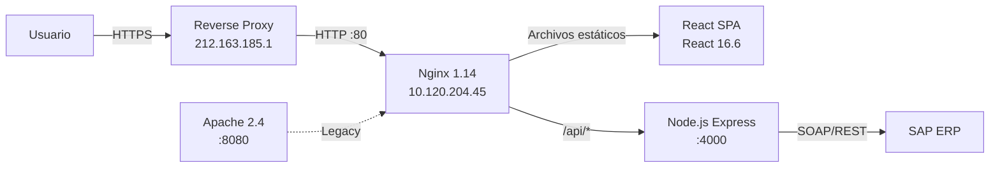

# Accriva Tickets

Portal de gestión de tickets de reparación y RGA (Return Goods Authorization) para distribuidores Accriva de Werfen.

## Estado actual

| Indicador | Estado |
|-----------|--------|
| 🟢 **Frontend (React SPA)** | Operativo — servido por Nginx |
| 🔴 **Backend (Node.js API)** | **CAÍDO** — crash loop en `nodeserver.service` |
| 🔴 **SSL** | Expirado desde 2020 |
| 🟡 **Servidor** | Online pero swap al 90%, kernel obsoleto |

## Arquitectura

## Entornos

| Entorno | Servidor | OS | Estado |
|---------|----------|----|--------|
| [🧪 TEST](test/) | `10.120.204.45` | SLES 15 SP1 | ⚠️ API caída |

## Stack tecnológico

| Componente | Tecnología | Versión | Notas |
|------------|-----------|---------|-------|
| **Frontend** | React | 16.6.3 | SPA con React Router |
| **Backend** | Node.js + Express | 8.17.0 | ⚠️ EOL desde dic. 2019 |
| **Process Manager** | PM2 | 3.2.2 | Inactivo, sin procesos |
| **Reverse Proxy** | Nginx | 1.14.2 | Config con typo en server_name |
| **Web Server** | Apache | 2.4.33 | Legacy, :8080 |
| **Integración** | SAP ERP | — | Web Services SOAP/REST |
| **DB** | — | — | Sin DB local, datos en SAP |

## Repositorio

| Dato | Valor |
|------|-------|
| **GitHub** | `Werfen-D-A/accriva-tickets` |
| **Estructura** | Monorepo: `client/` (React) + `services/api/` (Express) |
| **CI/CD** | ❌ No configurado — deploy manual |

## Hallazgos de seguridad

| Severidad | Cantidad | Principales |
|-----------|----------|-------------|
| 🔴 Crítico | 3 | SSL expirado, Node.js como root, CORS wildcard |
| 🟠 Alto | 3 | NODE_ENV=development, Node.js 8 EOL, sin firewall |
| 🟡 Medio | 5 | Nginx typo, Apache legacy, sin monitoring |
| 🔵 Bajo | 2 | Sin logrotate, headers incompletos |
