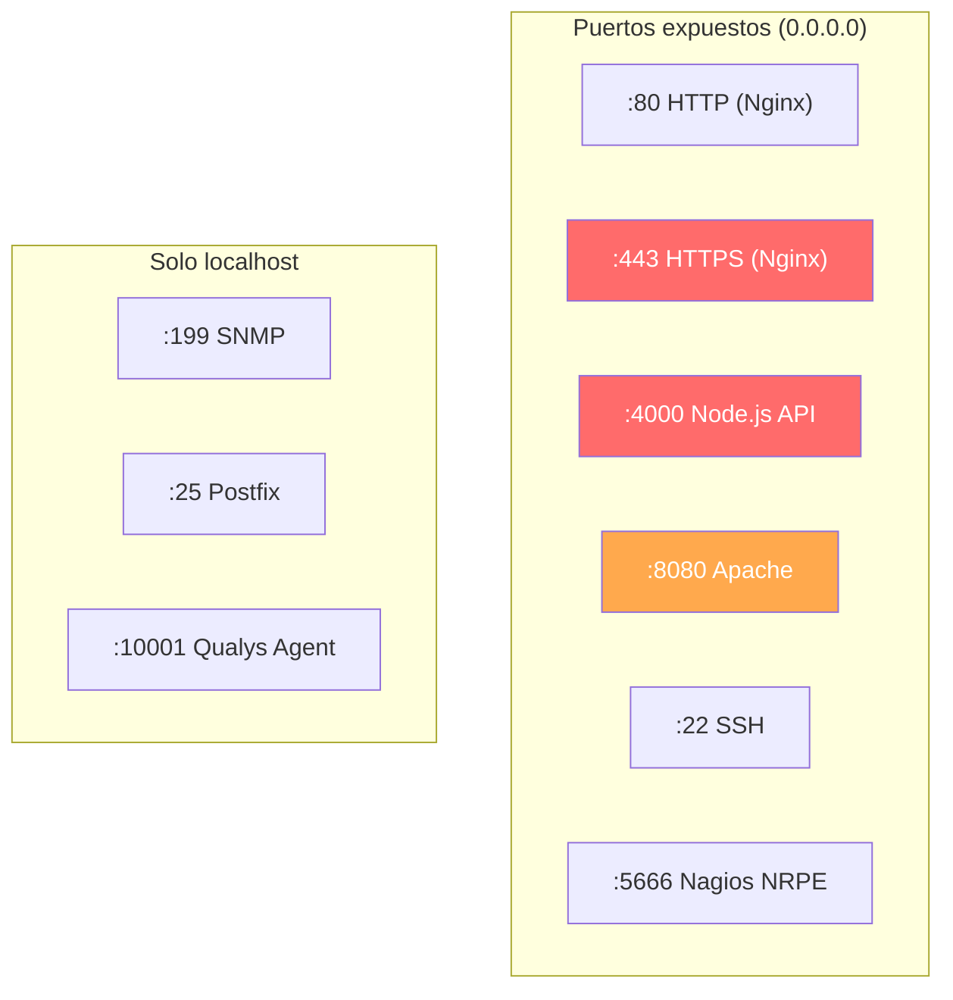

# Ciberseguridad — Accriva Tickets TEST

**Servidor:** ACCRIVATICKETSTEST (10.120.204.45)  
**Fecha de auditoría:** 2026-04-27

---

##  Resumen Ejecutivo

:::danger[Estado general: ALTO RIESGO]
Se han identificado **6 hallazgos críticos** y **5 hallazgos de riesgo medio**. El hallazgo más grave es el **certificado SSL expirado desde 2020**, seguido del servicio Node.js ejecutándose como root con NODE_ENV=development.
:::

| Severidad | Cantidad | Hallazgos |
|-----------|----------|-----------|
| 🔴 Crítico | 3 | SSL expirado, servicio como root, CORS wildcard |
| 🟠 Alto | 3 | NODE_ENV=development, sin firewall, dependencias vulnerables |
| 🟡 Medio | 5 | Kernel obsoleto, swap saturada, typo DNS, backups sin cifrar, SLES sin soporte |
| 🟢 Bajo | 2 | Logs sin rotación, Apache redundante |

---

##  SSL / TLS

### Certificado actual

| Parámetro | Valor |
|-----------|-------|
| **Sujeto** | `CN=*.werfen.com` (wildcard) |
| **Emisor** | GoDaddy Secure Certificate Authority - G2 |
| **Válido desde** | 2017-11-13 |
| **Expirado** | **2020-12-05** ⛔ |
| **Ubicación cert** | `/etc/apache2/ssl.crt/werfen.crt` |
| **Ubicación key** | `/etc/nginx/certs/werfen.key` |

:::danger[Certificado expirado hace más de 5 años]
El certificado SSL `*.werfen.com` expiró el **5 de diciembre de 2020**. Los navegadores muestran advertencias de seguridad. Cualquier comunicación HTTPS está técnicamente cifrada pero **no es de confianza**.

**Remediación inmediata:**

1. Obtener nuevo certificado wildcard `*.werfen.com` (GoDaddy o Let's Encrypt)
2. Reemplazar en `/etc/apache2/ssl.crt/werfen.crt` y `/etc/nginx/certs/werfen.key`
3. `systemctl reload nginx`
4. Verificar: `openssl s_client -connect accrivaticketstest.werfen.com:443`
:::

---

##  Hallazgos Críticos

### 1. Servicio Node.js ejecutándose como root

**Severidad:** 🔴 Crítico  
**Archivo:** `/etc/systemd/system/accrivanodeapi.service`

El servicio `accrivanodeapi` no tiene directivas `User=` ni `Group=`, por lo que se ejecuta como **root**. Si un atacante logra Remote Code Execution (RCE) a través de la API, obtiene acceso completo al sistema.

**Remediación:**

```ini
[Service]
User=deploy
Group=users
```

```bash
systemctl daemon-reload
systemctl restart accrivanodeapi
```

---

### 2. CORS Wildcard — Access-Control-Allow-Origin: *

**Severidad:** 🔴 Crítico  
**Archivo:** `/srv/www/htdocs/accriva-tickets/services/api/index.js`

```javascript
app.use(cors());
res.header("Access-Control-Allow-Origin", "*");
```

La API permite peticiones desde **cualquier origen**. Esto permite ataques CSRF y expone la API a cualquier sitio web malicioso.

**Remediación:**

```javascript
app.use(cors({
    origin: ['https://accrivaticketstest.werfen.com', 'https://distributorstest.werfen.com'],
    credentials: true
}));
```

---

### 3. Certificado SSL expirado

Ver sección SSL/TLS arriba.

---

##  Hallazgos de Alto Riesgo

### 4. NODE_ENV=development en servicio de producción

**Severidad:** 🟠 Alto  
**Archivo:** `/etc/systemd/system/accrivanodeapi.service`

```ini
Environment=NODE_ENV=development
```

Esto causa que:

- Express muestre **stack traces completos** en errores
- Se cargue `.env.development` (con posibles credenciales de dev)
- Se deshabiliten optimizaciones de rendimiento
- Se expongan detalles internos de la aplicación

**Remediación:**

```ini
Environment=NODE_ENV=production
```

---

### 5. Sin reglas de firewall

**Severidad:** 🟠 Alto

```
Chain INPUT (policy ACCEPT)
target     prot opt source               destination
Chain FORWARD (policy ACCEPT)
Chain OUTPUT (policy ACCEPT)
```

Todas las cadenas de iptables tienen policy **ACCEPT** sin ninguna regla. Cualquier puerto abierto es accesible desde toda la red.

**Remediación:**

```bash
# Solo permitir tráfico necesario
iptables -A INPUT -i lo -j ACCEPT
iptables -A INPUT -m state --state ESTABLISHED,RELATED -j ACCEPT
iptables -A INPUT -p tcp --dport 22 -j ACCEPT    # SSH
iptables -A INPUT -p tcp --dport 80 -j ACCEPT    # HTTP
iptables -A INPUT -p tcp --dport 443 -j ACCEPT   # HTTPS
iptables -A INPUT -p tcp --dport 5666 -j ACCEPT  # Nagios
iptables -A INPUT -j DROP
```

---

### 6. Dependencias npm con vulnerabilidades conocidas

**Severidad:** 🟠 Alto

| Paquete | Versión actual | Estado |
|---------|---------------|--------|
| `axios` | ^0.18.0 | Vulnerabilidades de SSRF, prototype pollution |
| `request` | ^2.88.0 | **DEPRECATED** desde 2020, sin parches |
| `node-fetch` | ^2.3.0 | Vulnerabilidades en v2 |
| `crypto-js` | ^3.1.9-1 | Versión con bugs conocidos |
| `react-scripts` | 2.1.1 | Muy desactualizado, Webpack 4 |

**Remediación:**

```bash
cd /srv/www/htdocs/accriva-tickets/services/api
npm audit
npm audit fix
# Actualizar manualmente las dependencias deprecated
```

---

##  Hallazgos de Riesgo Medio

### 7. Kernel y OS sin soporte

| Componente | Versión | Fin de soporte |
|------------|---------|----------------|
| SLES 15 SP1 | 15.1 | Enero 2021 (general) |
| Kernel | 4.12.14 (2019) | Sin parches |

### 8. Swap saturada al 90%

7.0 GiB de 7.8 GiB de swap en uso — presión de memoria que puede causar OOM kills.

### 9. Typo en configuración DNS de Nginx

`server_name acrrivaticketstest.werfen.com` (doble 'r') — funciona solo porque es `default_server`.

### 10. Backups sin cifrar en el servidor

Los directorios `accriva-tickets-bk*` contienen código fuente y potencialmente archivos `.env` con credenciales SAP.

### 11. Archivos .env con credenciales SAP accesibles

```
-rw-r--r-- 1 deploy users 123 .env.development
-rw-r--r-- 1 deploy users 126 .env.production
```

Los archivos `.env` son **legibles por todos** (permisos `644`). Deberían ser `600`.

```bash
chmod 600 /srv/www/htdocs/accriva-tickets/services/api/.env.*
```

---

##  Superficie de Ataque



:::danger[Node.js API expuesta directamente]
El puerto **4000** (Node.js API) está escuchando en `0.0.0.0` — accesible directamente desde la red, sin pasar por Nginx. Debería escuchar solo en `127.0.0.1`.

**Remediación** en `index.js`:
```javascript
app.listen(4000, '127.0.0.1', () => { ... });
```
:::

---

##  Controles de Seguridad Activos

| Control | Estado | Herramienta |
|---------|--------|-------------|
| Antivirus/EDR | ✅ Activo | Microsoft Defender ATP (`mdatp.service`) |
| Vulnerability Scanner | ✅ Activo | Qualys Cloud Agent |
| Monitorización | ✅ Activo | Nagios NRPE |
| Auditoría del sistema | ✅ Activo | auditd |
| AD Integration | ✅ Activo | winbind (Samba) |
| Firewall | ❌ Desactivado | iptables (todo ACCEPT) |
| IDS/IPS | ❌ No presente | — |
| WAF | ❌ No presente | — |
| Certificate Management | ❌ No funcional | Cert expirado 2020 |
| Log monitoring | ❌ No configurado | Logs sin alertas |

---

##  Plan de Remediación Priorizado

| # | Prioridad | Acción | Esfuerzo | Impacto |
|---|-----------|--------|----------|---------|
| 1 | 🔴 Inmediata | Renovar certificado SSL | 1h | Restaurar confianza HTTPS |
| 2 | 🔴 Inmediata | Cambiar NODE_ENV a production | 5 min | Ocultar stack traces |
| 3 | 🔴 Inmediata | Añadir User=deploy al systemd unit | 5 min | Limitar privilegios |
| 4 | 🔴 Inmediata | Bind Node.js API a 127.0.0.1 | 5 min | Cerrar puerto 4000 |
| 5 | 🟠 Esta semana | Configurar iptables | 30 min | Reducir superficie ataque |
| 6 | 🟠 Esta semana | Restringir CORS origins | 15 min | Prevenir CSRF |
| 7 | 🟠 Esta semana | `chmod 600` archivos .env | 1 min | Proteger credenciales |
| 8 | 🟡 Este mes | Actualizar dependencias npm | 2h | Cerrar CVEs conocidos |
| 9 | 🟡 Este mes | Planificar upgrade a SLES 15 SP5+ | Variable | Soporte de seguridad |
| 10 | 🟡 Este mes | Limpiar backups + cifrar sensibles | 30 min | Reducir exposición |
| 11 | 🟢 Próximo trimestre | Implementar WAF | Variable | Protección de capa 7 |
| 12 | 🟢 Próximo trimestre | Aumentar RAM VM | 15 min | Resolver swap saturada |
