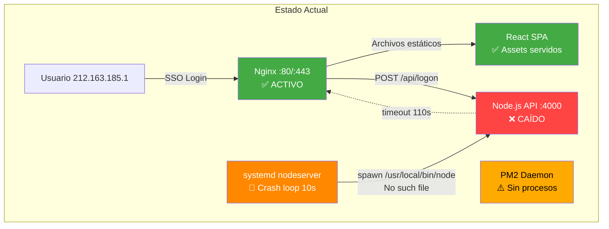

# Análisis de Logs en Vivo — Accriva Tickets TEST

:::info[Captura realizada]
**Fecha**: 27 de abril de 2026, 16:11 CEST  
**Servidor**: `accrivaticketstest.werfen.com` (10.120.204.45)  
**Ventana**: Últimos 20 minutos de actividad
:::

---

## Resumen Ejecutivo

| Indicador | Estado | Detalle |
|-----------|--------|---------|
| **Nginx (reverse proxy)** | :white_check_mark: Activo | Sirviendo peticiones HTTP/HTTPS |
| **Node.js (backend API)** | :x: **CAÍDO** | Crash loop continuo cada 10s |
| **PM2 (process manager)** | :warning: Inactivo | Último arranque: Nov 2024, sin procesos |
| **Actividad de usuario** | :white_check_mark: Sí | Acceso SSO desde 212.163.185.1 |

---

## 1. Nginx — Access Log

### Actividad en los últimos 20 minutos

Se registró una sesión de usuario completa a las **16:10:49 CEST**:

```log
212.163.185.1 - - [27/Apr/2026:16:10:49 +0200] "GET /SSO/Q0FSRElB HTTP/1.0" 200 3277
  referrer: "https://distributorstest.werfen.com/"

212.163.185.1 - - [27/Apr/2026:16:10:49 +0200] "GET /static/css/1.69cf18e9.chunk.css HTTP/1.0" 200 22094
212.163.185.1 - - [27/Apr/2026:16:10:49 +0200] "GET /static/css/main.3ed5b6bb.chunk.css HTTP/1.0" 200 8311
212.163.185.1 - - [27/Apr/2026:16:10:49 +0200] "GET /static/js/1.fd4a1c49.chunk.js HTTP/1.0" 200 245180
212.163.185.1 - - [27/Apr/2026:16:10:49 +0200] "GET /static/js/main.cd3943c6.chunk.js HTTP/1.0" 200 64446
212.163.185.1 - - [27/Apr/2026:16:10:49 +0200] "GET /static/media/werfen-logo-white.1f621af6.png HTTP/1.0" 200 14505
212.163.185.1 - - [27/Apr/2026:16:10:50 +0200] "GET /manifest.json HTTP/1.0" 200 306
212.163.185.1 - - [27/Apr/2026:16:10:50 +0200] "GET /static/js/main.cd3943c6.chunk.js HTTP/1.0" 200 64446
212.163.185.1 - - [27/Apr/2026:16:10:50 +0200] "GET /static/js/1.fd4a1c49.chunk.js HTTP/1.0" 200 245180
212.163.185.1 - - [27/Apr/2026:16:10:55 +0200] "GET /static/media/EEMEAI_Instrument_return_instructions__17_10_2024.726fe2d6.pdf HTTP/1.0" 200 96840
  referrer: "https://accrivaticketstest.werfen.com/ticket/2003332942"
212.163.185.1 - - [27/Apr/2026:16:10:56 +0200] "GET /static/media/EEMEAI_Instrument_return_instructions__17_10_2024.726fe2d6.pdf HTTP/1.0" 200 96840
212.163.185.1 - - [27/Apr/2026:16:10:56 +0200] "GET /static/media/EEMEAI_Instrument_return_instructions__17_10_2024.726fe2d6.pdf HTTP/1.0" 206 1025
```

### Análisis de la sesión

| Aspecto | Detalle |
|---------|---------|
| **Origen** | `212.163.185.1` (IP corporativa Werfen) |
| **Entrada** | SSO via `/SSO/Q0FSRElB` desde `distributorstest.werfen.com` |
| **Navegación** | Accedió al ticket `#2003332942` |
| **Descarga** | PDF de instrucciones de devolución de instrumentos (EEMEAI, 96KB) |
| **Protocolo** | HTTP/1.0 (a través de reverse proxy Nginx) |
| **User-Agent** | Chrome 147 en Windows 10 x64 |
| **Respuestas** | Todas `200 OK` (+ un `206 Partial Content` para descarga parcial PDF) |

:::tip[Diagnóstico Nginx]
El frontend React se sirve correctamente. Nginx responde en menos de 1 segundo para todos los assets estáticos. No hay errores 4xx ni 5xx en los últimos 20 minutos.
:::

### Actividad anterior reciente

También se detectó actividad idéntica el **20/Apr/2026 a las 21:34** (mismo usuario, misma ruta SSO).

---

## 2. Nginx — Error Log

:::danger[Sin errores nuevos en los últimos 20 minutos]
Los últimos errores de Nginx datan del **12/Feb/2026** — todos son `upstream timed out` al intentar contactar con el backend Node.js en `127.0.0.1:4000`.
:::

### Errores recurrentes (histórico)

```log
2026/02/12 12:44:50 [error] upstream timed out (110: Connection timed out)
  while reading response header from upstream
  request: "POST /api/logon HTTP/1.0"
  upstream: "http://127.0.0.1:4000/api/logon"
  referrer: "https://accrivaticketstest.werfen.com/SSO/Q0FSRElB"
```

**Patrón**: 6 errores de timeout entre las 12:44 y 15:06 del 12/Feb/2026, todos en `POST /api/logon`.

### Intentos de ataque detectados (histórico)

```log
2024/03/13 23:22:53 [error] open() "...build/xyz\n\n<script>alert(7738);</script>abc.jsp"
  failed (2: No such file or directory)
  client: 10.120.202.3 (escáner de seguridad interno)
```

:::warning[Escaneo de seguridad]
Se detectaron intentos de XSS y path traversal desde `10.120.202.3` el 13/Mar/2024. Corresponden a un escáner de seguridad interno (Qualys/similar). Nginx bloqueó todos los intentos correctamente.
:::

---

## 3. Systemd Journal — `nodeserver.service`

:::danger[CRÍTICO: Node.js en crash loop]
El servicio `nodeserver.service` está atrapado en un **bucle de reinicio infinito** desde hace más de 20 minutos. Falla cada 10 segundos.
:::

### Patrón de error (cada 10 segundos)

```log
Apr 27 16:09:04 systemd[1]: nodeserver.service: Failed with result 'exit-code'.
Apr 27 16:09:14 systemd[1]: nodeserver.service: Service RestartSec=10s expired, scheduling restart.
Apr 27 16:09:14 systemd[1]: Stopped Node.js Example Server.
Apr 27 16:09:14 systemd[1]: Started Node.js Example Server.
Apr 27 16:09:14 systemd[17549]: nodeserver.service: Failed at step EXEC spawning
  /usr/local/bin/node: No such file or directory
Apr 27 16:09:14 systemd[1]: nodeserver.service: Main process exited, code=exited, status=203/EXEC
Apr 27 16:09:14 systemd[1]: nodeserver.service: Unit entered failed state.
Apr 27 16:09:14 systemd[1]: nodeserver.service: Failed with result 'exit-code'.
```

### Causa raíz

| Factor | Detalle |
|--------|---------|
| **Error** | `Failed at step EXEC spawning /usr/local/bin/node: No such file or directory` |
| **Código de salida** | `203/EXEC` — el ejecutable no existe |
| **Frecuencia** | Cada **10 segundos** (RestartSec=10s) |
| **Impacto** | La API REST en `:4000` está completamente caída |
| **Causa** | Node.js no está instalado en `/usr/local/bin/node` (se instaló vía NVM en otra ruta, o se desinstaló) |

### Cronología en los 20 minutos capturados

```
16:09:04 → 16:09:14 → 16:09:24 → 16:09:34 → 16:09:44 → 16:09:54
→ 16:10:04 → 16:10:14 → 16:10:24 → 16:10:34 → 16:10:44 → 16:10:54
→ 16:11:04 → 16:11:14 → 16:11:24 → 16:11:34
```

**16 reintentos fallidos** en ~2.5 minutos capturados. A este ritmo, genera **~8.640 entradas de log por día** solo por este crash loop.

### Sesión SSH detectada

```log
Apr 27 16:11:43 sshd[17594]: Accepted keyboard-interactive/pam for root
  from 10.120.57.120 port 58306 ssh2
Apr 27 16:11:43 systemd[1]: Started Session 159 of user root.
```

Esta es nuestra propia conexión SSH para la extracción de logs.

---

## 4. PM2 — Process Manager

### Estado actual

PM2 está instalado (v3.2.2) pero **no gestiona ningún proceso activo**.

```log
PM2 | 2024-11-29T08:58:49: PM2 log: --- New PM2 Daemon started ---
PM2 | 2024-11-29T08:58:49: PM2 log: PM2 version   : 3.2.2
PM2 | 2024-11-29T08:58:49: PM2 log: Node.js version: 8.17.0
```

| Dato | Valor |
|------|-------|
| **Último arranque** | 29/Nov/2024 08:58 |
| **Versión PM2** | 3.2.2 (obsoleta, actual es 5.x) |
| **Versión Node.js** | 8.17.0 (EOL desde dic. 2019) |
| **Procesos gestionados** | 0 (ninguno activo) |

### Historial PM2

| Fecha | Evento |
|-------|--------|
| 03/Dic/2018 | Primer arranque, app `index` en fork mode |
| 11/Dic/2018 | Restart de `index` |
| 22/Ene/2019 | Restart de `index` (nuevo proceso id:1) |
| 01/Feb/2019 | Múltiples SIGKILL (4 reinicios forzados en 8 min) |
| 01/Feb/2019 | PM2 detenido completamente (`Exited peacefully`) |
| 29/Nov/2024 | PM2 Daemon reiniciado (sin procesos cargados) |

---

## 5. Node.js Application Logs

:::warning[Sin logs de aplicación]
No se encontraron ficheros de log de la aplicación Node.js. El directorio `/var/log/accriva-tickets/` no existe. Los logs de Winston configurados en la app no se están generando porque el servicio nunca llega a arrancar.
:::

---

## Diagnóstico General



---

## Acciones Recomendadas

### :rotating_light: Prioridad Crítica

| # | Acción | Comando de verificación |
|---|--------|------------------------|
| 1 | **Detener el crash loop** de `nodeserver.service` | `systemctl stop nodeserver.service && systemctl disable nodeserver.service` |
| 2 | **Localizar Node.js** real en el sistema | `which node && node --version` o `find / -name node -type f 2>/dev/null` |
| 3 | **Corregir ExecStart** en el unit file | `systemctl cat nodeserver.service` → actualizar ruta del binario |

### :warning: Prioridad Alta

| # | Acción | Detalle |
|---|--------|---------|
| 4 | Actualizar Node.js 8.17 → 18 LTS o 20 LTS | Node.js 8 lleva EOL desde diciembre 2019 |
| 5 | Actualizar PM2 3.2.2 → 5.x | Y configurar para gestionar el servicio |
| 6 | Crear directorio de logs | `mkdir -p /var/log/accriva-tickets && chown node:node /var/log/accriva-tickets` |

### :information_source: Prioridad Normal

| # | Acción | Detalle |
|---|--------|---------|
| 7 | Configurar `logrotate` para logs de la app | Evitar crecimiento descontrolado |
| 8 | Reducir `RestartSec` o añadir `StartLimitBurst` | Evitar spam de logs en el journal |
| 9 | Monitorizar con alerta | Configurar Nagios check para `nodeserver.service` |
