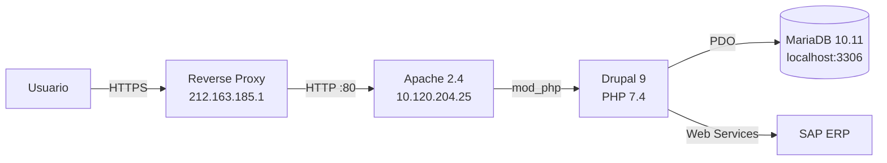

# Distributors Portal

Portal e-business B2B para distribuidores Werfen (Werfen Lab E-Business — WLEB).

## Estado actual

| Indicador | Estado |
|-----------|--------|
| 🟢 **Web (Drupal 9)** | Operativo |
| 🟢 **Base de datos (MariaDB)** | Operativa |
| 🟢 **Apache** | Sirviendo HTTP |
| 🟡 **Servidor** | Online, 535 días sin reinicio |

## Arquitectura

## Entornos

| Entorno | Servidor | OS | Estado |
|---------|----------|----|--------|
| [🧪 TEST](test/) | `10.120.204.25` | SLES 15 SP6 | 🟢 Operativo |

## Stack tecnológico

| Componente | Tecnología | Versión | Notas |
|------------|-----------|---------|-------|
| **CMS** | Drupal | 9 | Site principal |
| **Lenguaje** | PHP | 7.4 | ⚠️ EOL desde nov. 2022 |
| **Web Server** | Apache | 2.4 | HTTP, SSL en proxy externo |
| **DB** | MariaDB | 10.11 | Solo acceso local |
| **Integración** | SAP ERP | — | Web Services |
| **Mail** | Postfix | — | Solo localhost |

## Repositorio

| Dato | Valor |
|------|-------|
| **Despliegue** | Manual vía SFTP / SSH |
| **CI/CD** | ❌ No configurado |
| **Backups** | MariaDB dumps manuales |
