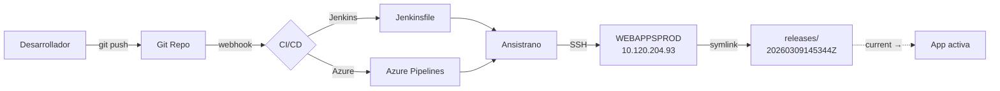

# DevOps & Deploy — MyOrders DEMO

## Estrategia de despliegue



## Ansistrano (deployment tool)

| Propiedad | Valor |
|-----------|-------|
| **Herramienta** | Ansistrano (Ansible + Capistrano pattern) |
| **Playbook** | `.ansistrano/deploy-webs-develop.yml` |
| **Rollback** | `.ansistrano/rollback-webs-develop.yml` |
| **Deploy user** | `deploy:nginx` |
| **Releases dir** | `/srv/www/htdocs/webapps/demo/ordersapp/releases/` |
| **Shared dir** | `/srv/www/htdocs/webapps/demo/ordersapp/shared/` |
| **Current symlink** | `current → ./releases/20260309145344Z` |

### Estructura de releases

```
/srv/www/htdocs/webapps/demo/ordersapp/
├── current → ./releases/20260309145344Z    ← Symlink activo
├── releases/                                ← Historial de releases
│   └── 20260309145344Z/                    ← Release actual (9 mar 2026)
├── repo/                                    ← Repositorio Git clonado
└── shared/                                  ← Archivos compartidos (.env, uploads)
    └── .env                                ← Variables de entorno (symlinked)
```

## CI/CD Pipelines

### Jenkins

```
deployment/
├── Jenkinsfile              ← Pipeline principal
├── jenkins/                 ← Scripts auxiliares
├── orders-app/              ← Deploy config orders-app
├── orders-backoffice/       ← Deploy config backoffice
├── orders-tracking/         ← Deploy config tracking
├── monthlyreport/           ← Deploy config reports
├── myclaims/                ← Deploy config claims
├── rga/                     ← Deploy config RGA
├── orders-all/              ← Deploy todas las apps
├── nodb/                    ← Deploy sin migraciones DB
├── develop/                 ← Config entorno develop
└── shared/                  ← Scripts compartidos
```

### Azure Pipelines

| Archivo | Uso |
|---------|-----|
| `azure-pipelines.yml` | Pipeline principal |
| `deployment/azure-pipelines-webapps.yml` | Pipeline webapps |
| `deployment/azure-pipelines.yml` | Pipeline deployment |

## Desarrollo local — DDEV

| Propiedad | Valor |
|-----------|-------|
| **Herramienta** | DDEV (Docker-based dev env) |
| **Config** | `.ddev/` |
| **DB local** | `ddev-webapps-db:3306` |

### Docker Compose extras

| Servicio | Archivo |
|----------|---------|
| Elasticsearch | `.ddev/docker-compose.elasticsearch.yaml` |
| Kibana | `.ddev/docker-compose.kibana.yaml` |
| Mailer | `.ddev/docker-compose.mailer.yaml` |

### Makefile — Comandos disponibles

| Target | Descripción |
|--------|-------------|
| `make Start` | Iniciar DDEV |
| `make buildWebPack` | `ddev npm run watch` |
| `make ClearCache` | `bin/console c:c` |
| `make LaunchUnitTest` | PHPUnit completo |
| `make LaunchIntegrationTest` | PHPUnit grupo Integration |
| `make launchPhpStan` | Análisis estático |
| `make launchPhpCsFixer` | Fix code style |
| `make E2EOrders` | Playwright E2E orders |
| `make E2EMonthlyreport` | Playwright E2E reports |
| `make E2EVendorsportal` | Playwright E2E vendors |
| `make E2ERga` | Playwright E2E RGA |
| `make XdebugOn/Off` | Activar/desactivar Xdebug |
| `make ConfigPreCommit` | Configurar git hooks |
| `make monthlyreport-prepare` | Setup monthly report (elastica + migrations + import) |

## Testing

### PHPUnit

| Tipo | Comando | Cobertura |
|------|---------|-----------|
| Unit | `make LaunchUnitTest` | `phpunit_tests.html` disponible |
| Integration | `make LaunchIntegrationTest` | Grupo `Integration` |
| Coverage | `make launchUnitTestWithCoverage` | HTML report en `./coverage-report` |

### Playwright (E2E)

| Propiedad | Valor |
|-----------|-------|
| **Directorio** | `playwright-test/` |
| **Config** | `playwright-test/playwright.config.ts` |
| **Proyectos** | orders, monthlyreport, vendorsportal, rga |
| **Resultado** | `playwright_result.txt` |
| **Workers** | 1 (secuencial) |

### Análisis estático

| Herramienta | Config | Uso |
|-------------|--------|-----|
| **PHPStan** | `phpstan.neon` | Análisis de tipos |
| **php-cs-fixer** | `.php-cs-fixer.dist.php` | Code style |
| **Baseline** | `phpstan-baseline.neon` (458 KB) | Errores conocidos |

## Git Hooks

Pre-push hook configurado para ejecutar PHPStan y php-cs-fixer antes de push:

```bash
# Configurar hooks
cp .githooks/pre-push .git/hooks/
chmod +x .git/hooks/pre-push
# Ejecutar SIEMPRE desde WSL, no desde el contenedor
```

## Gestión de configuración

### Variables de entorno

El archivo `.env` es un symlink a `../../shared/.env`, lo que permite mantener las credenciales fuera del directorio de release.

### Configuración Symfony (config/packages/)

| Archivo | Propósito |
|---------|-----------|
| `doctrine.yaml` | Configuración ORM y conexiones DB |
| `security.yaml` | Firewalls, providers, access control |
| `sentry.yaml` | DSN y configuración de Sentry |
| `webpack_encore.yaml` | Assets, entrypoints |
| `lexik_jwt_authentication.yaml` | JWT auth config |
| `monolog.yaml` | Logging (channels, handlers) |
| `cache.yaml` | Cache pools |
| `mailer.yaml` | SMTP config |
| `translation.yaml` | i18n config |
| `framework.yaml` | Symfony framework config |
