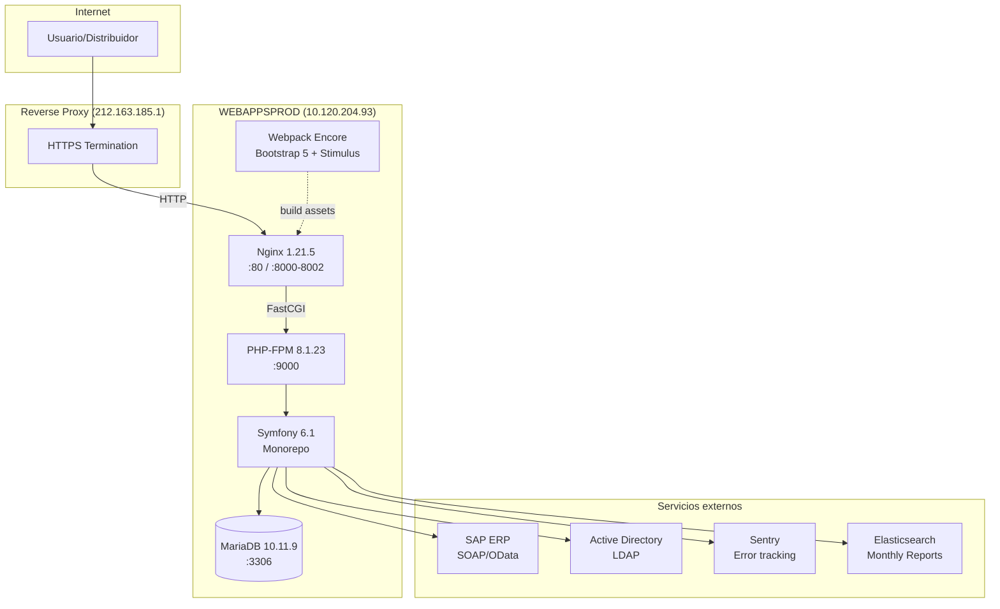
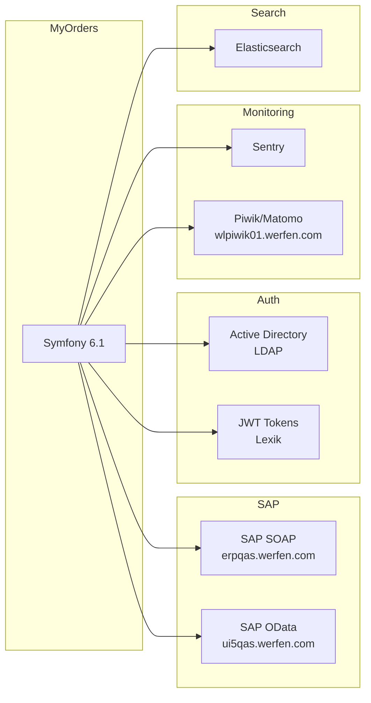

# Web Stack — MyOrders DEMO

## Resumen de la arquitectura



## Nginx — Configuración

### Configuración principal

| Parámetro | Valor |
|-----------|-------|
| **worker_processes** | 1 |
| **worker_connections** | 1024 |
| **Event model** | epoll |
| **keepalive_timeout** | 65 |
| **sendfile** | on |

### Virtual Hosts del proyecto MyOrders

| Dominio | Puerto | App | Document Root |
|---------|--------|-----|---------------|
| `dist-orders-demo.werfen.com` | 80 | orders-app | `demo/ordersapp/current/apps/orders/orders-app/public/` |
| `admin-orders-demo.werfen.com` | 80 | orders-backoffice | `demo/ordersbackoffice/current/apps/orders/orders-backoffice/public/` |
| `ordertrackingdemo.werfen.com` | 80 | orders-tracking | `demo/orderstracking/current/apps/orders/orders-tracking/public/` |

### Configuración típica del vhost (orders-app demo)

```nginx
server {
    listen       80;
    server_name  dist-orders-demo.werfen.com;
    server_tokens on;

    location / {
        root   /srv/www/htdocs/webapps/demo/ordersapp/current/apps/orders/orders-app/public/;
        index  index.php;
        try_files $uri $uri/ /index.php$is_args$args;
    }

    location ~ \.php$ {
        root            .../apps/orders/orders-app/public/;
        fastcgi_pass   127.0.0.1:9000;
        fastcgi_index  index.php;
        fastcgi_param  SCRIPT_FILENAME $document_root$fastcgi_script_name;
        include        fastcgi_params;
        fastcgi_buffers 16 32k;
        fastcgi_buffer_size 64k;
        fastcgi_busy_buffers_size 64k;
        fastcgi_connect_timeout 300;
        fastcgi_send_timeout 300;
        fastcgi_read_timeout 300;
    }
}
```

:::info Vhost de producción (newmyorders.werfen.com)
El vhost de producción incluye headers de seguridad adicionales: `Cache-Control`, `Content-Security-Policy` con restricciones para scripts, estilos, fuentes, imágenes y frames. El vhost de demo **no** los tiene.
:::

### Otros vhosts en el servidor

| Dominio | Aplicación | Puerto |
|---------|------------|--------|
| `newmyorders.werfen.com` | orders-app (PROD) | 80 |
| `newmyordersadmin.werfen.com` | orders-backoffice (PROD) | 80 |
| `track-and-trace.werfen.com` | orders-tracking (PROD) | 80 |
| `caseportal.werfen.com` | Case Portal | 80 |
| `myclaims.werfen.com` / `myclaims-demo.werfen.com` | MyClaims | 80 |
| `regulatoryportaldemo.werfen.com` | Regulatory Portal | 80 |
| `websites.werfen.com` | Websites | 80 |
| `vendorsportal.werfen.com` | Vendors Portal | 8001 |
| `welisten` | WeListen | 8000 |
| `middlewareadp` | Middleware ADP | 8002 |

## PHP-FPM 8.1

| Parámetro | Valor |
|-----------|-------|
| **Versión** | PHP 8.1.23 (NTS) |
| **Puerto** | 127.0.0.1:9000 |
| **Workers activos** | 4 procesos |
| **Modo** | FastCGI |

### Extensiones requeridas (composer.json)

| Extensión | Uso |
|-----------|-----|
| `ext-ctype` | Validación de caracteres |
| `ext-iconv` | Conversión de charset |
| `ext-openssl` | Cifrado, JWT |
| `ext-soap` | Integración SAP |
| `ext-zip` | Exportación de archivos |

## Symfony 6.1 — Monorepo

### Estructura del proyecto

```
/srv/www/htdocs/webapps/demo/ordersapp/current/
├── apps/                    ← Sub-aplicaciones (kernels independientes)
│   ├── orders/             ← MyOrders principal
│   │   ├── orders-app/     ← Portal distribuidor
│   │   ├── orders-backoffice/ ← Admin EasyAdmin
│   │   └── orders-tracking/   ← Track & trace
│   ├── monthlyreport/     ← Informes mensuales
│   ├── rga/                ← Return goods
│   ├── vendorsportal/      ← Portal proveedores
│   ├── welisten/           ← Encuestas
│   ├── middlewareadp/      ← Integración ADP
│   └── websites/           ← Gestión websites
├── src/                     ← Código fuente compartido
│   ├── Ebusiness/          ← Lógica de pedidos, ofertas, precios
│   ├── Shared/             ← Utilidades comunes
│   ├── CasePortal/         ← Gestión de casos
│   ├── MonthlyReport/      ← Informes mensuales
│   ├── Welisten/           ← Encuestas
│   ├── Rga/                ← Return goods
│   └── Accrivatickets/     ← Tickets Accriva
├── config/                  ← Configuración Symfony
│   ├── packages/           ← Bundles config
│   │   ├── doctrine.yaml
│   │   ├── security.yaml
│   │   ├── sentry.yaml
│   │   ├── webpack_encore.yaml
│   │   └── ...
│   └── services.yaml
├── templates/               ← Twig templates
│   ├── base/               ← Layout base, navbar, macros
│   ├── orders/             ← Templates de pedidos
│   ├── monthlyreport/      ← Templates informes
│   └── login/              ← Formularios login
├── assets/                  ← Frontend source
│   ├── orders/             ← JS/SCSS pedidos
│   ├── orders-backoffice/  ← JS backoffice
│   ├── orders-tracking/    ← JS tracking
│   ├── monthlyreport/      ← JS informes
│   ├── vendorsportal/      ← JS proveedores
│   ├── rga/                ← JS returns
│   ├── welisten/           ← JS encuestas
│   └── base/               ← Shared assets
├── deployment/              ← CI/CD configs
│   ├── Jenkinsfile
│   ├── azure-pipelines.yml
│   └── orders-app/         ← Deploy scripts por app
├── tests/                   ← PHPUnit tests
├── playwright-test/         ← E2E tests
├── migrations/              ← DB migrations
├── public/                  ← Web root (index.php)
├── vendor/                  ← Composer dependencies
├── node_modules/            ← NPM dependencies
├── .env → ../../shared/.env ← Symlink a env compartido
└── var/                     ← Cache, logs, uploads
```

### Dependencias principales (Composer)

| Paquete | Versión | Propósito |
|---------|---------|-----------|
| `symfony/*` | 6.1.* | Framework core |
| `doctrine/orm` | ^2.14 | ORM / DB abstraction |
| `easycorp/easyadmin-bundle` | ^4.5 | Admin panel |
| `lexik/jwt-authentication-bundle` | ^2.19 | JWT auth |
| `sentry/sentry-symfony` | ^5.0 | Error monitoring |
| `dompdf/dompdf` | ^3.1 | PDF generation |
| `phpoffice/phpspreadsheet` | ^1.29 | Excel export |
| `friendsofsymfony/elastica-bundle` | ^6.2 | Elasticsearch |
| `enqueue/enqueue-bundle` | * | Message queues |

### Dependencias frontend (package.json)

| Paquete | Propósito |
|---------|-----------|
| `@symfony/webpack-encore` | ^4.0 — Build tool |
| `bootstrap` | ^5.1.3 — UI framework |
| `@hotwired/stimulus` | ^3.0 — JS framework |
| `sweetalert2` | ^11.7 — Alertas modales |
| `tom-select` | ^2.2 — Select mejorado |
| `sass` | ^1.51 — Preprocesador CSS |

## MariaDB 10.11.9

| Parámetro | Valor |
|-----------|-------|
| **Versión** | 10.11.9 |
| **Puerto** | 3306 (localhost only) |
| **Proceso** | `mysqld` |

### Bases de datos

| Base de datos | Uso |
|---------------|-----|
| `orders` | Producción — pedidos, usuarios, ofertas |
| `orders_demo` | Demo — misma estructura |
| `mysql` | Sistema MariaDB |
| `information_schema` | Metadatos |
| `performance_schema` | Métricas rendimiento |
| `sys` | Vistas de diagnóstico |

## Integraciones externas



| Sistema | URL/Host | Protocolo | Uso |
|---------|----------|-----------|-----|
| **SAP ERP (SOAP)** | `erpqas.werfen.com` | SOAP | Pedidos, precios, stock, tareas |
| **SAP ERP (OData)** | `ui5qas.werfen.com` | OData REST | Monthly reports, CRM orders |
| **Active Directory** | Configurado via LDAP | LDAP | Autenticación de usuarios |
| **Elasticsearch** | Configurado | REST | Búsquedas, monthly reports |
| **Sentry** | Configurado | HTTPS | Error tracking |
| **Piwik/Matomo** | `wlpiwik01.werfen.com` | HTTPS | Analytics |
| **Mailer** | Postfix localhost | SMTP | Notificaciones |

## Errores recientes en logs

### Nginx error.log (últimas 48h)

:::warning Error en build/app.js — 404
Los admin panels (tanto demo como prod) no encuentran el fichero `/build/app.js`, provocando errores 404. Esto indica que los assets de Webpack no se han compilado o desplegado correctamente para ordersbackoffice.
:::

```log
# Demo - admin-orders-demo.werfen.com
2026/04/24 13:32:31 [error] FastCGI: NotFoundHttpException
"No route found for GET http://admin-orders-demo.werfen.com/build/app.js"
→ ordersbackoffice/releases/20260218204918Z/vendor/symfony/.../RouterListener.php:128

# Prod - newmyordersadmin.werfen.com  
2026/04/23 10:15:56 [error] FastCGI: NotFoundHttpException
"No route found for GET http://newmyordersadmin.werfen.com/build/app.js"
→ ordersbackoffice/releases/20260312101808Z/vendor/symfony/.../RouterListener.php:128
```

### Escaneo de seguridad detectado (caseportal)

:::caution Nmap scan detectado
El 25/04/2026 a las 06:49 se detectó un escaneo Nmap desde `212.163.185.1` contra `caseportal.werfen.com`. Se probaron múltiples rutas (/owa/, /webui, /HNAP1, /sdk, /versa/login, etc.).
:::
