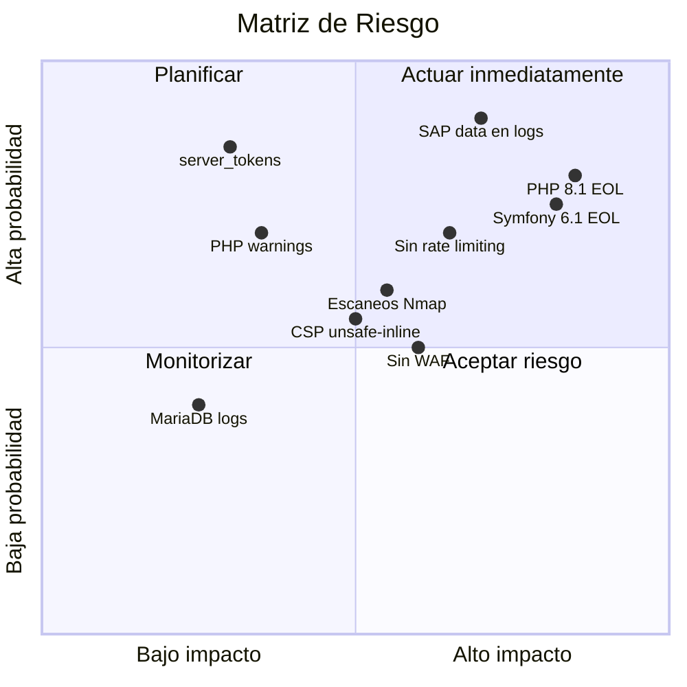

# Auditoría de Seguridad basada en Logs

**Servidor**: WEBAPPSPROD (`10.120.204.93`)  
**Fecha de auditoría**: 27 abril 2026  
**Período de logs**: 23 abril – 27 abril 2026  
**Fuentes**: nginx error.log, nginx access.log, php-fpm.log, journalctl, mysqld.log, monolog.yaml

## Resumen ejecutivo

| Severidad | Hallazgos | Detalle |
|-----------|-----------|---------|
| 🔴 **Crítico** | 3 | Escaneos de reconocimiento múltiples, fuga de información SAP en logs, versiones obsoletas |
| 🟠 **Alto** | 4 | Monolog a stderr, login SSO sin rate limit, server_tokens on, sin WAF |
| 🟡 **Medio** | 4 | CSP con unsafe-inline, slow query log deshabilitado, binary log off, PHP warnings en prod |
| 🟢 **Bajo** | 3 | Logs compartidos entre vhosts, RecordedFuture crawler, sin health endpoint |

---

## Análisis de versiones de software

### Versiones detectadas y estado de seguridad

| Software | Versión | EOL / Estado | CVEs conocidos |
|----------|---------|-------------|----------------|
| **PHP** | 8.1.23 | ⚠️ EOL: 31 dic 2025 | PHP 8.1 dejó de recibir parches de seguridad. Vulnerable a CVEs post-EOL |
| **Symfony** | 6.1.x | ⚠️ EOL: ene 2023 | Symfony 6.1 finalizó soporte en enero 2023. Sin parches de seguridad desde hace 3+ años |
| **Nginx** | 1.21.5 | ⚠️ Antigua | Versión mainline de dic 2021. Múltiples fixes de seguridad publicados desde entonces |
| **MariaDB** | 10.11.9 | ✅ LTS | Soporte hasta feb 2028. Versión actual con parches de seguridad |
| **SLES** | 15 SP6 | ✅ Activo | Soporte de largo plazo activo |

:::danger PHP 8.1 — End of Life
PHP 8.1 alcanzó su fin de vida el **31 de diciembre de 2025**. Esto significa que **no se publican parches de seguridad** desde hace 4 meses. Cualquier vulnerabilidad descubierta después de esa fecha queda sin corregir.

**Acción requerida**: Migrar a PHP 8.2 (soporte hasta dic 2026) o PHP 8.3 (soporte hasta dic 2027).
:::

:::danger Symfony 6.1 — Sin soporte desde enero 2023
Symfony 6.1 es una versión **non-LTS** cuyo soporte finalizó en **enero 2023**. Lleva más de **3 años sin actualizaciones de seguridad**.

**Acción requerida**: Migrar a Symfony 6.4 LTS (soporte hasta nov 2027) o Symfony 7.x.
:::

---

## Hallazgos de seguridad desde logs

### 🔴 SEC-01 — Escaneos de reconocimiento múltiples

**Evidencia**: Se han detectado **3 escaneos distintos** en el período analizado:

**Escaneo 1 — Nmap contra caseportal.werfen.com** (25 abril, 06:49):
```
/human.aspx, /webui, /geoserver/, /owa/, /HNAP1, /nmaplowercheck1777092535,
/cgi-bin/info.cgi, /+CSCOE+/logon.html, /dana-na/nc/nc_gina_ver.txt,
/api/v1/check-version, /Account/Login, /helpdesk/WebObjects/Helpdesk.woa,
/versa/login, /sdk, /dniapi/userInfos, /cluster/list.query,
/administrator/manifests/files/joomla.xml, /apps/zxtm/login.cgi
```
- IP origen: `212.163.185.1` (reverse proxy corporativo)
- Firma: URL `/nmaplowercheck1777092535` confirma Nmap NSE scripts
- ~**20 rutas probadas** en 90 segundos

**Escaneo 2 — Scan contra myclaims.werfen.com** (23 abril, 06:21):
```
/magento_version, /helpdesk/WebObjects/Helpdesk.woa, /rest/applinks/1.0/manifest,
/apps/zxtm/login.cgi, /confluence/rest/applinks/1.0/manifest,
/language/en-GB/en-GB.xml, /dniapi/userInfos, /health, /login.html,
/dashboard/, /webui/index.html, /p/login/, /routes, /api/version,
/api/server/version, /api/v1/check-version, /portal/, /status, /info.asp,
/home.html, /versa/login, /menu.html, /allversions, /Account/Login,
/main.pl, /cgi-mod/header_logo.cgi, /dana-cached/hc/HostCheckerInstaller.osx,
/ext-js/app/common/zld_product_spec.js, /admin/login
```
- ~**30 rutas probadas** en 90 segundos
- Incluye fingerprinting de Magento, Joomla, Confluence, GeoServer, Pulse VPN, Cisco ASA

**Escaneo 3 — RecordedFuture** (27 abril, 15:29):
```
GET / → 302
GET /admin/E/list → 302 (referrer: 100.27.6.242)
GET /E/login → 200
```
- IP: `10.250.8.10` (red interna)
- Identificado como servicio legítimo de threat intelligence

**Riesgo**: Los escaneos 1 y 2 muestran patrones de herramientas automatizadas probando vulnerabilidades conocidas. Aunque las respuestas fueron 404, la falta de rate limiting permite escaneos completos.

**Remediación**:
1. Implementar rate limiting en Nginx: `limit_req_zone` con burst bajo para rutas desconocidas
2. Configurar fail2ban para bloquear IPs con múltiples 404 en corto tiempo
3. Verificar con el equipo de seguridad si los scans son autorizados (auditoría interna)
4. Considerar un WAF (ModSecurity / Cloud WAF)

---

### 🔴 SEC-02 — Fuga de información SAP en logs

**Evidencia**: Cada login SSO genera mensajes en el error.log de Nginx que incluyen:
- Customer IDs de SAP (ej: `0000321227`, `0000111687`)
- Nombres de usuario de clientes (ej: `HOSPIMAX`, `GLOBALSCIENT`, `BIOCELL_MEDI`)
- Respuestas JSON completas de la API SAP

```
[ZQAU_USER_FROM_CLIENTE] Response for customer 0000321227: 
  username=HOSPIMAX, full response: {"E_USERNAME":"HOSPIMAX"}
```

**Riesgo**:
- **Violación de privacidad**: Los logs contienen datos de clientes en texto plano
- **Cumplimiento GDPR**: Los customer IDs y nombres de usuario son datos personales
- **Acceso no autorizado**: Cualquiera con acceso de lectura a `/var/log/nginx/error.log` puede ver datos de clientes

**Remediación**:
1. **Inmediato**: Cambiar el nivel de log de ZQAU a `DEBUG` (no aparecerá en prod con `fingers_crossed`)
2. Eliminar la respuesta JSON completa del mensaje de log
3. Ofuscar/hash los customer IDs en logs
4. Revisar la política de retención de logs (actualmente 365 días con datos de clientes)

---

### 🔴 SEC-03 — Stack de software obsoleto

**PHP 8.1.23** (EOL: 31 dic 2025):
- Sin parches de seguridad desde hace 4 meses
- Vulnerabilidades post-EOL no serán corregidas
- Riesgo de exploit de vulnerabilidades conocidas

**Symfony 6.1** (EOL: ene 2023):
- Más de 3 años sin actualizaciones de seguridad
- Symfony Security Advisories publicadas después de 6.1 no se aplican
- Symfony 6.2, 6.3, 6.4 LTS corrigieron múltiples vulnerabilidades

**Nginx 1.21.5** (dic 2021):
- Versión mainline de hace 4+ años
- Múltiples CVEs corregidos en versiones posteriores

**Remediación**:
1. **Urgente**: Planificar migración de PHP 8.1 → 8.3 (LTS)
2. **Urgente**: Planificar migración de Symfony 6.1 → 6.4 LTS
3. Actualizar Nginx a la última versión estable (1.26.x o superior)

---

### 🟠 SEC-04 — Monolog en producción vía stderr

**Evidencia**: La configuración `monolog.yaml` envía todos los logs de producción a `php://stderr`:

```yaml
when@prod:
    monolog:
        handlers:
            main:
                type: fingers_crossed
                action_level: error
                handler: nested
            nested:
                type: stream
                path: php://stderr    # ← Todo va al error.log de Nginx
                level: debug
                formatter: monolog.formatter.json
```

**Riesgo**:
- Los errores de aplicación se mezclan con errores de infraestructura
- Sin separación entre apps (ordersapp, ordersbackoffice, rga, etc.)
- Dificulta la detección de incidentes de seguridad
- Los logs de Symfony incluyen stack traces completos que podrían exponer rutas internas

**Remediación**:
1. Configurar un handler Monolog a archivo: `path: "%kernel.logs_dir%/prod.log"`
2. Añadir un handler tipo `syslog` con facility separada por app
3. Considerar centralización con ELK/Grafana Loki

---

### 🟠 SEC-05 — SSO Login sin rate limiting

**Evidencia**: Los logs muestran decenas de logins SSO por minuto sin ningún control de velocidad. Un atacante podría explotar el endpoint `/login?sso=` para:
- Enumeración de usuarios
- Fuerza bruta de tokens SSO
- Denegación de servicio (cada login genera 2-4 llamadas a la API SAP)

```
06:57:37 — login?sso=... → customer 0000321227
06:57:46 — login?sso=... → customer 0000111687 (NOT FOUND)
06:57:47 — login?sso=... → customer 0000112216 (NOT FOUND)
07:09:35 — login?sso=... → customer 0000289638
07:11:17 — login?sso=... → customer 0000427536 (NOT FOUND)
```

**Remediación**:
1. Implementar rate limiting en Nginx para `/login`:
   ```nginx
   limit_req_zone $binary_remote_addr zone=login:10m rate=5r/m;
   location /login { limit_req zone=login burst=10; }
   ```
2. Implementar rate limiting en la aplicación (Symfony RateLimiter)
3. Añadir mecanismo de bloqueo tras múltiples intentos fallidos

---

### 🟠 SEC-06 — server_tokens habilitado

**Evidencia**: Detectado en la configuración de vhosts de Nginx. Expone `Server: nginx/1.21.5` en las respuestas HTTP.

**Riesgo**: Facilita la identificación de la versión exacta del servidor para ataques dirigidos.

**Remediación**: Cambiar a `server_tokens off;` en `nginx.conf`.

---

### 🟠 SEC-07 — Sin WAF (Web Application Firewall)

**Evidencia**: Los escaneos Nmap y de fingerprinting llegaron sin ser bloqueados. No hay evidencia de ModSecurity, cloud WAF, o cualquier capa de protección.

**Riesgo**: Ataques web (SQLi, XSS, path traversal) llegarán directamente a la aplicación.

**Remediación**: Implementar al menos:
1. ModSecurity con OWASP CRS como WAF local
2. O un Cloud WAF (Cloudflare, AWS WAF, Azure WAF) frente al servidor

---

### 🟡 SEC-08 — CSP con 'unsafe-inline'

**Evidencia**: El CSP del vhost de producción permite `script-src 'unsafe-inline'`:
```
script-src 'self' 'unsafe-inline' cdn.jsdelivr.net code.jquery.com ...
```

**Riesgo**: Reduce significativamente la protección contra ataques XSS, ya que permite la ejecución de scripts inline inyectados.

**Remediación**: Migrar a nonces (`script-src 'nonce-xxx'`) o hashes para scripts inline.

---

### 🟡 SEC-09 — Slow query log deshabilitado

**Evidencia**: En `/etc/my.cnf`: `# slow_query_log=1` (comentado).

**Riesgo**: No se detectan queries lentas que podrían indicar ataques de inyección SQL o problemas de rendimiento.

**Remediación**: Habilitar con `slow_query_log = 1` y `long_query_time = 2`.

---

### 🟡 SEC-10 — Binary log deshabilitado

**Evidencia**: En `/etc/my.cnf`: `# log_bin=mysql-bin` (comentado).

**Riesgo**: Sin binary log no es posible:
- Auditar cambios en la base de datos
- Recuperación point-in-time después de un incidente
- Replicación para DR

**Remediación**: Habilitar `log_bin` y configurar retención adecuada.

---

### 🟡 SEC-11 — PHP warnings en producción

**Evidencia**: VendorsPortal genera PHP warnings visibles que exponen rutas internas:
```
PHP Warning: Trying to access array offset on value of type null in 
/srv/www/htdocs/webapps/vendorsportal/releases/20250731071018Z/apps/vendorsportal/
src/Controller/PendingInvoices/PendingInvoicesController.php on line 39
```

**Riesgo**: Los path completos revelan la estructura del servidor, versiones de deploy (timestamps) y tecnología usada.

**Remediación**:
1. Configurar `display_errors = Off` en `php.ini` (verificar que está desactivado)
2. Corregir los null access en los controladores
3. Configurar `error_reporting` para no mostrar warnings en prod

---

### 🟢 SEC-12 — Intentos de acceso a MariaDB

**Evidencia**:
```
2025-11-05 14:13:24 — Access denied for user 'mhernandez2'@'localhost' (using password: YES)
2025-11-05 14:18-14:36 — Múltiples conexiones sin autenticar cerradas
```

**Riesgo**: Bajo. Parece un intento legítimo con credenciales incorrectas seguido de troubleshooting.

**Remediación**: Verificar que no hay más intentos fallidos recurrentes. Considerar alertas para brute force.

---

### 🟢 SEC-13 — Logs compartidos entre vhosts

**Evidencia**: Todos los vhosts (8 dominios) comparten un único `error.log` y `access.log`.

**Riesgo**: Un analista de seguridad de un proyecto podría ver datos de otro proyecto. Dificulta la correlación y el triage de incidentes.

**Remediación**: Configurar `error_log` y `access_log` separados por vhost.

---

### 🟢 SEC-14 — Sin endpoint de health check

**Evidencia**: Los scans prueban `/health`, `/status`, `/api/version` — todos retornan 404.

**Riesgo**: Sin health check, la monitorización depende de probes externos que no pueden verificar el estado real de la aplicación.

**Remediación**: Implementar endpoints `/health` y `/ready` con verificación de conexión a BD y servicios.

---

## Matriz de riesgo



## Plan de remediación priorizado

| Prioridad | Acción | Esfuerzo | Impacto |
|-----------|--------|----------|---------|
| 1 | Migrar PHP 8.1 → 8.3 | Alto | Crítico — EOL sin parches |
| 2 | Migrar Symfony 6.1 → 6.4 LTS | Alto | Crítico — 3 años sin seguridad |
| 3 | Mover ZQAU logging de stderr a Monolog channel | Bajo | Alto — Fuga de datos SAP |
| 4 | Implementar rate limiting en `/login` | Bajo | Alto — Previene brute force |
| 5 | `server_tokens off` en nginx.conf | Bajo | Medio — Quick win |
| 6 | Actualizar Nginx 1.21.5 → 1.26.x | Medio | Medio — CVEs conocidos |
| 7 | Habilitar slow query log | Bajo | Medio — Detección SQLi |
| 8 | Configurar logs separados por vhost | Bajo | Medio — Aislamiento |
| 9 | Implementar WAF (ModSecurity) | Medio | Alto — Protección web |
| 10 | Migrar CSP a nonces | Medio | Medio — Protección XSS |
