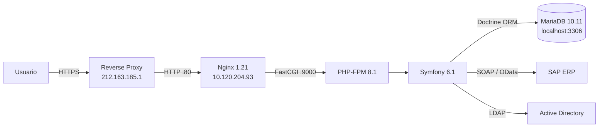

# MyOrders

Plataforma web e-business para gestión de pedidos, ofertas, tracking y backoffice de distribuidores Werfen. Monorepo Symfony multi-app alojado en el servidor compartido **Web Apps Demo/Prod**.

## Estado actual

| Indicador | Estado |
|-----------|--------|
| 🟢 **Frontend (Symfony + Bootstrap)** | Operativo |
| 🟢 **PHP-FPM** | Activo — PHP 8.1 |
| 🟢 **Nginx** | Sirviendo HTTP en port 80 |
| 🟢 **MariaDB** | Activa — 10.11.9 |
| 🟡 **Disco** | 81% usado (113/146 GB) |
| 🟡 **build/app.js** | 404 en ordersbackoffice admin |

## Arquitectura

## Entornos

| Entorno | Servidor | OS | Estado |
|---------|----------|----|--------|
| [🧪 DEMO](demo/) | `10.120.204.93` | SLES 15 SP6 | 🟢 Operativo |

## Stack tecnológico

| Componente | Tecnología | Versión | Notas |
|------------|-----------|---------|-------|
| **Framework** | Symfony | 6.1 | Monorepo multi-app |
| **Lenguaje** | PHP | 8.1.23 | CLI + FPM |
| **Web Server** | Nginx | 1.21.5 | Reverse proxy + FastCGI |
| **DB** | MariaDB | 10.11.9 | DB `orders_demo` |
| **Frontend** | Bootstrap 5 | + Stimulus | Webpack Encore |
| **Build** | Webpack Encore | 4.x | Node.js 20.15.1 |
| **Auth** | LDAP + JWT | Lexik | Active Directory |
| **Integración** | SAP ERP | SOAP/OData | Pedidos, precios, stock |
| **Monitoring** | Sentry | 5.x | Error tracking |
| **Deploy** | Ansistrano | Jenkins / Azure | CI/CD |
| **Testing** | PHPUnit + Playwright | — | Unit + E2E |

## Sub-aplicaciones del monorepo

| App | Dominio (Demo) | Descripción |
|-----|----------------|-------------|
| **orders-app** | `dist-orders-demo.werfen.com` | Portal principal de pedidos para distribuidores |
| **orders-backoffice** | `admin-orders-demo.werfen.com` | Panel de administración (EasyAdmin) |
| **orders-tracking** | `ordertrackingdemo.werfen.com` | Seguimiento de pedidos |
| **rga** | — | Return Goods Authorization |
| **monthlyreport** | — | Informes mensuales (Elasticsearch) |
| **vendorsportal** | — | Portal de proveedores (port 8001) |
| **welisten** | — | Encuestas de satisfacción (port 8000) |
| **middlewareadp** | — | Integración ADP (port 8002) |

## Otros proyectos en el mismo servidor

| Proyecto | Entorno | Path |
|----------|---------|------|
| myclaims | demo | `/srv/www/htdocs/webapps/demo/myclaims` |
| regulatory-portal | demo | `/srv/www/htdocs/webapps/demo/regulatory-portal` |
| rga | demo | `/srv/www/htdocs/webapps/demo/rga` |
