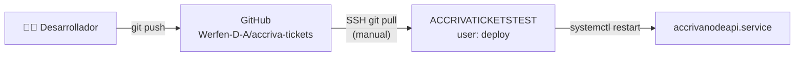

# DevOps — Accriva Tickets TEST

**Servidor:** ACCRIVATICKETSTEST (10.120.204.45)  
**Fecha de auditoría:** 2026-04-27

---

## :material-source-repository: Repositorio Git

| Parámetro | Valor |
|-----------|-------|
| **Remote** | `git@github.com:Werfen-D-A/accriva-tickets.git` |
| **Plataforma** | GitHub (organización Werfen-D-A) |
| **Monorepo** | Sí — `client/` (React) + `services/api/` (Node.js) |
| **Último commit** | `7c816eb` — Merge PR #3 (SRI integrity attributes) |
| **Fecha último push en server** | 2025-02-12 15:03 |

### Historial reciente (en servidor)

```
7c816eb Merge PR #3 — SRI integrity attributes
42385a4 Add SRI integrity attributes to external CDN resources
d8b7026 Merge PR #2 — Edit log ticket detail
daff458 Edit sap call log request/response in get ticket detail
af3b697 Merge PR #1 — Add log ticket detail
dec313f Add sap call log request/response in get ticket detail
9b71d3b Merged ITR-181307-- (PR #16)
a6dc654 ITR-181307: update logic showing EEMEA instructions
9a25e97 Merged ITR-181307- (PR #15)
1338cc7 ITR-181307: update docs of instructions
```

---

## :material-rocket-launch: Proceso de Despliegue

### Flujo actual



### Pasos de deploy (manual)

```bash
# 1. Conectar como deploy user
ssh deploy@10.120.204.45

# 2. Ir al directorio de la aplicación
cd /srv/www/htdocs/accriva-tickets

# 3. Pull de cambios
git pull origin master

# 4. Si hay cambios en dependencias del API
cd services/api && npm install

# 5. Si hay cambios en el frontend → build en local/CI y push del build
# (El build de React está committeado en el repo)

# 6. Reiniciar el servicio Node.js (como root)
sudo systemctl restart accrivanodeapi

# 7. Verificar
systemctl status accrivanodeapi
curl -s http://localhost:4000/api/ | head
```

!!! warning "Deploy manual sin CI/CD"
    No hay pipeline de CI/CD configurado. El deploy es completamente manual via `git pull`. El frontend (React build) está **committeado en el repo** — no se reconstruye en el servidor.

### Usuarios del sistema

| Usuario | Función | Home |
|---------|---------|------|
| `root` | Administración, systemd, configs | `/root` |
| `deploy` | Owner de archivos de la app | `/home/deploy` |

!!! info "Propietario de archivos"
    Los archivos de la aplicación pertenecen al usuario `deploy` (grupo `users`). Sin embargo, algunos archivos críticos (`package.json`, `docker-compose.yml`, `.gitignore`, `Dockerfile`, `node_modules/`) pertenecen a **root**, indicando ediciones manuales directas en producción.

---

## :material-docker: Docker (solo desarrollo)

### docker-compose.yml

```yaml
version: '3'
services:
  client:
    volumes:
      - ./client/src:/usr/src/app/src
      - ./client/public:/usr/src/app/public
    command: npm run start
    build: ./client/
    ports: ["3000:3000"]
    links: [api]
    env_file: [./client/.env.development]

  api:
    build: ./services/api
    ports: ["4000:4000"]
    volumes:
      - ./services/api:/usr/src/app/
      - /usr/src/app/node_modules
    command: npm run dev
```

!!! info "Docker NO se usa en el servidor"
    Docker compose está configurado para **desarrollo local** únicamente. En el servidor, la aplicación corre directamente con Node.js via systemd.

### Dockerfile del API

```dockerfile
# /srv/www/htdocs/accriva-tickets/services/api/Dockerfile
# (configurado para desarrollo local)
```

---

## :material-cog: Gestión de Servicios

### Comandos systemd

```bash
# Estado del API
systemctl status accrivanodeapi

# Reiniciar API
systemctl restart accrivanodeapi

# Ver logs del API
journalctl -u accrivanodeapi -f

# Estado de Nginx
systemctl status nginx

# Reload Nginx (sin downtime)
systemctl reload nginx

# Estado de Apache
systemctl status apache2
```

### Auto-restart

El servicio `accrivanodeapi` tiene `Restart=always` y `RestartSec=10`. Si el proceso Node.js crashea, systemd lo reinicia automáticamente tras 10 segundos.

---

## :material-backup-restore: Backups

### Backups encontrados en el servidor

| Directorio | Tamaño est. | Fecha | Notas |
|------------|-------------|-------|-------|
| `/srv/www/htdocs/accriva-tickets-bk/` | — | Desconocida | Backup sin fecha |
| `/srv/www/htdocs/accriva-tickets-bk2/` | — | Desconocida | Segundo backup sin fecha |
| `/srv/www/htdocs/accriva-tickets-12-07-2021/` | — | 2021-07-12 | Backup con fecha |

!!! warning "Backups sin gestión"
    Los backups son copias manuales del directorio de la aplicación. No hay:
    
    - Script de backup automatizado
    - Rotación de backups antiguos
    - Backup de configuración (nginx, systemd unit)
    - Política de retención documentada
    
    Se recomienda limpiar los backups antiguos para liberar espacio en disco (raíz al 67%).

---

## :material-cron: Tareas Programadas

No hay cron jobs configurados (`crontab -l` vacío).

---

## :material-monitor-dashboard: Monitorización

| Herramienta | Estado | Puerto | Función |
|-------------|--------|--------|---------|
| **Nagios (NRPE)** | ✅ Activo | :5666 | Monitorización remota |
| **SNMP** | ✅ Activo | :199 (localhost) | Métricas SNMP |
| **Qualys** | ✅ Activo | :10001 | Vulnerability scanning |
| **Microsoft Defender** | ✅ Activo | — | Endpoint protection |

---

## :material-checklist: Recomendaciones DevOps

| # | Prioridad | Recomendación |
|---|-----------|--------------|
| 1 | 🔴 Alta | Implementar CI/CD pipeline (GitHub Actions) |
| 2 | 🔴 Alta | Separar build de React del repo (usar CI para build) |
| 3 | 🟡 Media | Crear usuario sin privilegios para el servicio Node.js |
| 4 | 🟡 Media | Actualizar dependencias npm (vulnerabilidades conocidas) |
| 5 | 🟡 Media | Eliminar backups antiguos para liberar espacio |
| 6 | 🟢 Baja | Configurar log rotation para Winston logs |
| 7 | 🟢 Baja | Añadir healthcheck endpoint al API |
