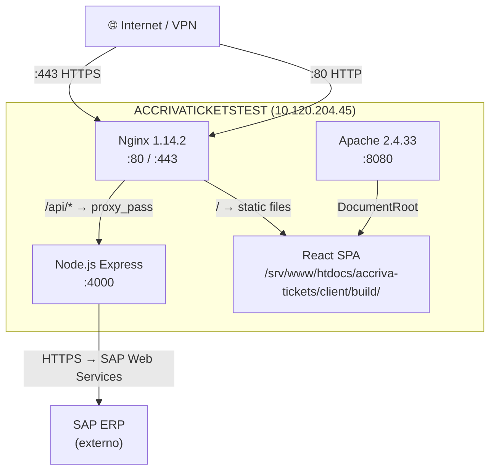

# Server Overview — ACCRIVATICKETSTEST

**IP:** 10.120.204.45  
**Hostname:** accrivaticketstest  
**Fecha de auditoría:** 2026-04-27 15:55 CEST

---

## :material-server: Sistema Operativo

| Parámetro | Valor |
|-----------|-------|
| **Distribución** | SUSE Linux Enterprise Server 15 SP1 |
| **Kernel** | 4.12.14-197.29-default (x86_64) |
| **Fecha del kernel** | 2019-12-06 |
| **Arquitectura** | x86_64 |

!!! warning "Kernel desactualizado"
    El kernel es de **diciembre 2019** — no recibe parches de seguridad. SLES 15 SP1 llegó a fin de soporte general en enero 2021.

---

## :material-cpu-64-bit: Hardware / Virtualización

| Parámetro | Valor |
|-----------|-------|
| **Plataforma** | VMware (open-vm-tools activo) |
| **CPU** | Intel Xeon Gold 5220R @ 2.20GHz |
| **vCPUs** | 1 |
| **RAM Total** | 7.5 GiB |
| **RAM Usada** | 5.5 GiB (73%) |
| **RAM Disponible** | 1.3 GiB |
| **Swap Total** | 7.8 GiB |
| **Swap Usada** | 7.0 GiB (90%) |

!!! danger "Swap al 90%"
    El servidor tiene 7.0 GiB de 7.8 GiB de swap en uso. Esto indica presión de memoria severa. La RAM disponible (1.3 GiB) es baja para la cantidad de servicios activos. Se recomienda:
    
    - Aumentar la RAM de la VM a 12-16 GiB
    - Investigar qué proceso consume más memoria (`ps aux --sort=-%mem | head`)
    - Considerar desactivar servicios innecesarios

---

## :material-harddisk: Almacenamiento

| Filesystem | Tamaño | Usado | Disponible | Uso% | Montaje |
|------------|--------|-------|------------|------|---------|
| `/dev/sda2` | 15G | 9.5G | 4.7G | 67% | `/` |
| `/dev/sda3` | 7.1G | 330M | 6.8G | 5% | `/home` |

!!! info "Disco raíz al 67%"
    El disco raíz tiene 4.7 GiB libres. No es crítico, pero los backups de la aplicación (accriva-tickets-bk, accriva-tickets-bk2, accriva-tickets-12-07-2021) en `/srv/www/htdocs/` podrían limpiarse para ganar espacio.

---

## :material-clock: Uptime

```
up 739 days 6:00, 0 users, load average: 0.01, 0.03, 0.00
```

!!! warning "739 días sin reinicio"
    Más de **2 años** sin reinicio. Esto implica que el kernel NO ha recibido actualizaciones que requieran reboot. El load average es excelente (prácticamente idle).

---

## :material-cog: Servicios Activos (32 servicios)

### Servicios de Aplicación

| Servicio | Puerto | Descripción |
|----------|--------|-------------|
| `accrivanodeapi.service` | :4000 | **API Node.js** — Express middleware → SAP |
| `nginx.service` | :80, :443 | **Reverse proxy** — sirve React SPA + proxy API |
| `apache2.service` | :8080 | **Apache httpd** — SPA secondario (legacy) |

### Servicios de Infraestructura

| Servicio | Puerto | Descripción |
|----------|--------|-------------|
| `sshd.service` | :22 | OpenSSH Daemon |
| `postfix.service` | :25 (localhost) | Mail Transport Agent |
| `chronyd.service` | — | NTP sincronización horaria |
| `cron.service` | — | Planificador de tareas |
| `nscd.service` | — | Cache de nombres (DNS/LDAP) |
| `rsyslog.service` | — | Sistema de logging |

### Servicios de Seguridad / Monitorización

| Servicio | Puerto | Descripción |
|----------|--------|-------------|
| `mdatp.service` | — | **Microsoft Defender** ATP |
| `qualys-cloud-agent.service` | — | **Qualys** vulnerability scanner |
| `nrpe.service` | :5666 | **Nagios** Remote Plugin Executor |
| `snmpd.service` | :199 (localhost) | SNMP monitoring |
| `auditd.service` | — | Linux Audit daemon |
| `winbind.service` | — | Samba/AD integration |

### Servicios de Sistema / VMware

| Servicio | Descripción |
|----------|-------------|
| `systemd-journald.service` | Journal logging |
| `systemd-logind.service` | Login service |
| `systemd-udevd.service` | Device manager |
| `dbus.service` | Message bus |
| `haveged.service` | Entropy daemon |
| `iscsid.service` | iSCSI |
| `lvm2-lvmetad.service` | LVM metadata |
| `vgauthd.service` | VMware vgauth |
| `vmblock-fuse.service` | VMware vmblock |
| `vmtoolsd.service` | VMware tools |
| `wickedd*.service` (×5) | Wicked network management |

---

## :material-ethernet: Red y Puertos

### Puertos en escucha

| Puerto | Servicio | Bind | Protocolo |
|--------|----------|------|-----------|
| **80** | nginx | 0.0.0.0 | HTTP |
| **443** | nginx | 0.0.0.0 | HTTPS (SSL) |
| **4000** | node (Express API) | 0.0.0.0 | HTTP |
| **8080** | httpd-prefork (Apache) | 0.0.0.0 | HTTP |
| **22** | sshd | 0.0.0.0 + [::] | SSH |
| **25** | postfix (master) | [::1] | SMTP (localhost) |
| **199** | snmpd | 127.0.0.1 | SNMP |
| **5666** | nrpe | 0.0.0.0 + [::] | Nagios |
| **10001** | agentid-service (Qualys) | 127.0.0.1 + 10.120.204.45 | Agent |

### Diagrama de red



---

## :material-information: Notas adicionales

- **Shell del root:** zsh (no bash — esto causa problemas con `for` loops en comandos SSH)
- **No hay base de datos local** — toda la persistencia está en SAP
- **No hay cron jobs** configurados
- **No hay reglas de firewall** — todas las chains de iptables están en ACCEPT
