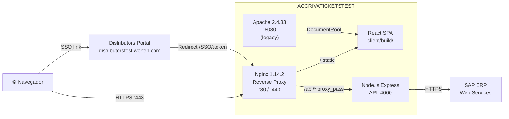
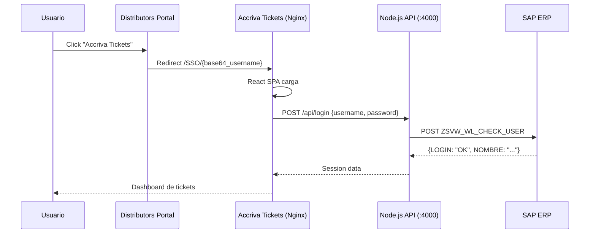

# Web Stack — Accriva Tickets TEST

**Servidor:** ACCRIVATICKETSTEST (10.120.204.45)  
**Fecha de auditoría:** 2026-04-27

---

## :material-layers-triple: Arquitectura General



| Capa | Tecnología | Versión | Puerto | Función |
|------|-----------|---------|--------|---------|
| Reverse Proxy | Nginx | 1.14.2 | :80, :443 | SSL termination, SPA serving, API proxy |
| API Backend | Node.js + Express | Node (sistema) | :4000 | Middleware entre React y SAP |
| Frontend | React | 16.6.3 | — | SPA servida como archivos estáticos |
| Web Server (legacy) | Apache httpd | 2.4.33 (prefork) | :8080 | VHost alternativo para la misma SPA |
| Backend externo | SAP ERP | — | externo | Datos de tickets, usuarios, RGA |

---

## :material-web: Nginx — Reverse Proxy

### Configuración principal

```nginx
# /etc/nginx/nginx.conf
worker_processes  1;
events { worker_connections 1024; use epoll; }
http {
    sendfile on;
    keepalive_timeout 65;
    include conf.d/*.conf;
    include vhosts.d/*.conf;
    # Default server (localhost:80) → /srv/www/htdocs/
}
```

### Site principal — `/etc/nginx/conf.d/default.conf`

```nginx
server {
    listen 80 default_server;
    listen 443 ssl;
    server_name acrrivaticketstest.werfen.com;  # ⚠️ TYPO: doble 'r'
    
    ssl_certificate /etc/apache2/ssl.crt/werfen.crt;
    ssl_certificate_key /etc/nginx/certs/werfen.key;

    # SPA — React client
    location / {
        add_header Cache-Control "no-store, no-cache, must-revalidate";
        root /srv/www/htdocs/accriva-tickets/client/build;
        if (!-e $request_filename) {
            rewrite ^(.*)$ /index.html break;
        }
    }

    # API — proxy al backend Node.js
    location /api/ {
        proxy_pass http://127.0.0.1:4000;
    }

    proxy_redirect off;
    proxy_set_header X-Real-IP $remote_addr;
    proxy_set_header X-Forwarded-For $proxy_add_x_forwarded_for;
    proxy_set_header X-Forwarded-Proto $scheme;
    proxy_set_header Host $host;
}
```

!!! bug "Typo en server_name"
    El server_name está configurado como `acrrivaticketstest.werfen.com` (doble 'r'). El dominio real es `accrivaticketstest.werfen.com`. Nginx funciona porque es el `default_server`, pero debería corregirse.

!!! danger "Certificado SSL expirado"
    El certificado `*.werfen.com` (GoDaddy) **expiró el 5 de diciembre de 2020**. HTTPS funciona pero el navegador muestra warnings de certificado no confiable.

### Archivos del site

| Archivo | Función |
|---------|---------|
| `/etc/nginx/conf.d/default.conf` | Site principal con SSL + proxy |
| `/etc/nginx/conf.d/global.pass` | Password file (SSL key passphrase) |
| `/etc/nginx/certs/werfen.key` | Clave privada SSL |
| `/etc/apache2/ssl.crt/werfen.crt` | Certificado SSL (compartido con Apache) |

---

## :material-nodejs: Node.js — API Backend

### Servicio systemd

```ini
# /etc/systemd/system/accrivanodeapi.service
[Unit]
Description= Accriva Tickets API Node Server on port 4000

[Service]
ExecStart=/usr/bin/node /srv/www/htdocs/accriva-tickets/services/api/index.js
WorkingDirectory=/srv/www/htdocs/accriva-tickets/services/api/
Restart=always
RestartSec=10
StandardOutput=syslog
StandardError=syslog
SyslogIdentifier=accrivaticketsapi
Environment=NODE_ENV=development

[Install]
WantedBy=multi-user.target
```

!!! warning "NODE_ENV=development en servidor de test"
    El servicio corre con `NODE_ENV=development`, lo que puede:
    
    - Exponer stack traces detallados en respuestas de error
    - Deshabilitar optimizaciones de producción
    - Cargar configuraciones de desarrollo (`.env.development`)

!!! warning "Servicio ejecuta como root"
    No hay directiva `User=` ni `Group=` — el proceso Node.js corre como **root**. Debería ejecutarse bajo un usuario sin privilegios.

### Paquete API

```json
{
  "name": "Accriva_Tickets_API",
  "version": "1.0.0",
  "main": "index.js",
  "dependencies": {
    "axios": "^0.18.0",
    "body-parser": "^1.18.3",
    "cors": "^2.8.5",
    "crypto-js": "^3.1.9-1",
    "custom-env": "^1.0.0",
    "express": "^4.16.4",
    "node-fetch": "^2.3.0",
    "request": "^2.88.0",
    "winston": "^3.2.1"
  }
}
```

!!! warning "Dependencias desactualizadas"
    - `axios ^0.18.0` → actual es 1.x (vulnerabilidades conocidas)
    - `request ^2.88.0` → **DEPRECATED** desde 2020
    - `body-parser` → integrado en Express 4.16+ (redundante)
    - `node-fetch ^2.3.0` → actual es 3.x

### Rutas API (Express)

| Método | Ruta | Función | Backend SAP |
|--------|------|---------|-------------|
| POST | `/api/login` | Login de usuario | `ZSVW_WL_CHECK_USER` |
| POST | `/api/logon` | Logon alternativo | `ZSVW_WL_CHECK_USER` |
| GET | `/api/instrument` | Buscar instrumentos | SAP Web Service |
| GET | `/api/instrument2` | Buscar instrumentos (v2) | SAP Web Service |
| GET | `/api/material` | Info de material | SAP Web Service |
| GET | `/api/status` | Estados de ticket | SAP Web Service |
| GET | `/api/mdr` | MDR (Medical Device Report) | SAP Web Service |
| POST | `/api/ticket/new` | Crear ticket nuevo | SAP Web Service |
| GET | `/api/ticket/single` | Ver ticket individual | SAP Web Service |
| GET | `/api/ticket/list` | Listar tickets | SAP Web Service |

### Configuración de entorno

```
# .env.development (variables — valores redactados)
SAP_URL=https://[SAP_HOST]/sap/bc/srt/xip/sap/
SAP_BASIC_AUTH_HEADER_B64=[REDACTED]
PORT=4000
```

```
# .env.production (mismo patrón, URL diferente)
SAP_URL=https://[SAP_HOST]/sap/bc/srt/xip/sap/
SAP_BASIC_AUTH_HEADER_B64=[REDACTED]
PORT=4000
```

### Servicio adicional

```
services/api/services/RepairCenterSetter.js  → Lógica de asignación de centro de reparación
```

---

## :material-react: React — Frontend SPA

### Paquete Cliente

```json
{
  "name": "Accriva_client",
  "version": "0.1.0",
  "dependencies": {
    "react": "^16.6.3",
    "react-dom": "^16.6.3",
    "react-redux": "^5.0.5",
    "redux": "^3.7.2",
    "react-router-dom": "^4.3.1",
    "react-table": "^6.8.6",
    "react-scripts": "2.1.1"
  }
}
```

### Rutas de la SPA

| Tipo | Ruta | Función |
|------|------|---------|
| Pública | `/SSO/:token` | Login SSO desde Distributors Portal |
| Pública | `/ISSlog` | Login manual para desarrolladores |
| Pública | `/logout` | Logout |
| Privada | `/` | Formulario de nuevo ticket |
| Privada | `/tickets` | Lista de mis tickets |
| Privada | `/tickets/:id` | Detalle de un ticket |

### Build de producción

Los archivos estáticos están en:

```
/srv/www/htdocs/accriva-tickets/client/build/
├── index.html
├── asset-manifest.json
├── favicon.ico
├── manifest.json
├── service-worker.js
├── precache-manifest.*.js
└── static/
    ├── css/
    │   ├── 1.69cf18e9.chunk.css
    │   └── main.3ed5b6bb.chunk.css
    ├── js/
    │   ├── 1.fd4a1c49.chunk.js
    │   └── main.cd3943c6.chunk.js
    └── media/
        └── werfen-logo-white.1f621af6.png
```

### Flujo de autenticación SSO



---

## :material-apache: Apache httpd — Servidor secundario

### VHost (`/etc/apache2/vhosts.d/vhosts.conf`)

```apache
<VirtualHost *:80>
    ServerName accrivaticketstest.werfen.com
    DocumentRoot /srv/www/htdocs/accriva-tickets/client/build
    ServerAdmin ipastor@werfen.com
    
    <Directory "srv/www/htdocs/accriva-tickets/client/build">
        RewriteEngine on
        RewriteCond %{REQUEST_FILENAME} -f [OR]
        RewriteCond %{REQUEST_FILENAME} -d
        RewriteRule ^ - [L]
        RewriteRule ^ index.html [L]
    </Directory>
</VirtualHost>
```

!!! info "Apache como fallback"
    Apache escucha en **:8080** (httpd-prefork, 6 workers). Sirve la misma SPA que Nginx pero **sin proxy al API**. Probablemente es una configuración legacy o un target para un load balancer que nunca se implementó.

!!! bug "Path sin barra inicial"
    La directiva `<Directory "srv/www/htdocs/...">` debería ser `<Directory "/srv/www/htdocs/...">` (falta la `/` inicial).

---

## :material-link-variant: Integración con SAP

La API Node.js actúa como **middleware** entre el frontend React y los Web Services de SAP:

| SAP Service | Función | Usado por |
|-------------|---------|-----------|
| `ZSVW_WL_CHECK_USER` | Autenticación de usuario distribuidor | `/api/login`, `/api/logon` |
| Ticket services | CRUD de tickets de reparación | `/api/ticket/*` |
| Material services | Catálogo de materiales/instrumentos | `/api/instrument*`, `/api/material` |
| RGA services | Return Goods Authorization | Creación de RS (Return Shipment) |

### Autenticación SAP

- Usa **Basic Auth** con credenciales base64 en variable `SAP_BASIC_AUTH_HEADER_B64`
- Las credenciales están en ficheros `.env.development` y `.env.production`

---

## :material-folder-open: Estructura de directorios en el servidor

```
/srv/www/htdocs/
├── accriva-tickets/              ← APLICACIÓN ACTIVA
│   ├── .git/                     ← Repo Git (deploy por git pull)
│   ├── client/
│   │   ├── build/                ← React SPA compilada (producción)
│   │   ├── src/                  ← Código fuente React
│   │   └── package.json
│   ├── services/
│   │   └── api/
│   │       ├── index.js          ← Entry point Express (20KB)
│   │       ├── services/
│   │       │   └── RepairCenterSetter.js
│   │       ├── .env.development  ← Config SAP (dev)
│   │       ├── .env.production   ← Config SAP (prod)
│   │       ├── info.log          ← Winston info log (196KB)
│   │       ├── error.log         ← Winston error log (3.7KB)
│   │       ├── create_rga_error.log ← RGA errors (3KB)
│   │       ├── node_modules/     ← 412 paquetes
│   │       └── package.json
│   ├── docker-compose.yml        ← Dev local (NO usado en server)
│   └── README.md
├── accriva-tickets-bk/           ← Backup (sin fecha)
├── accriva-tickets-bk2/          ← Backup 2 (sin fecha)
├── accriva-tickets-12-07-2021/   ← Backup de julio 2021
├── 50x.html
├── index.html                    ← Página por defecto Nginx
└── nginx-error-pages/
```
