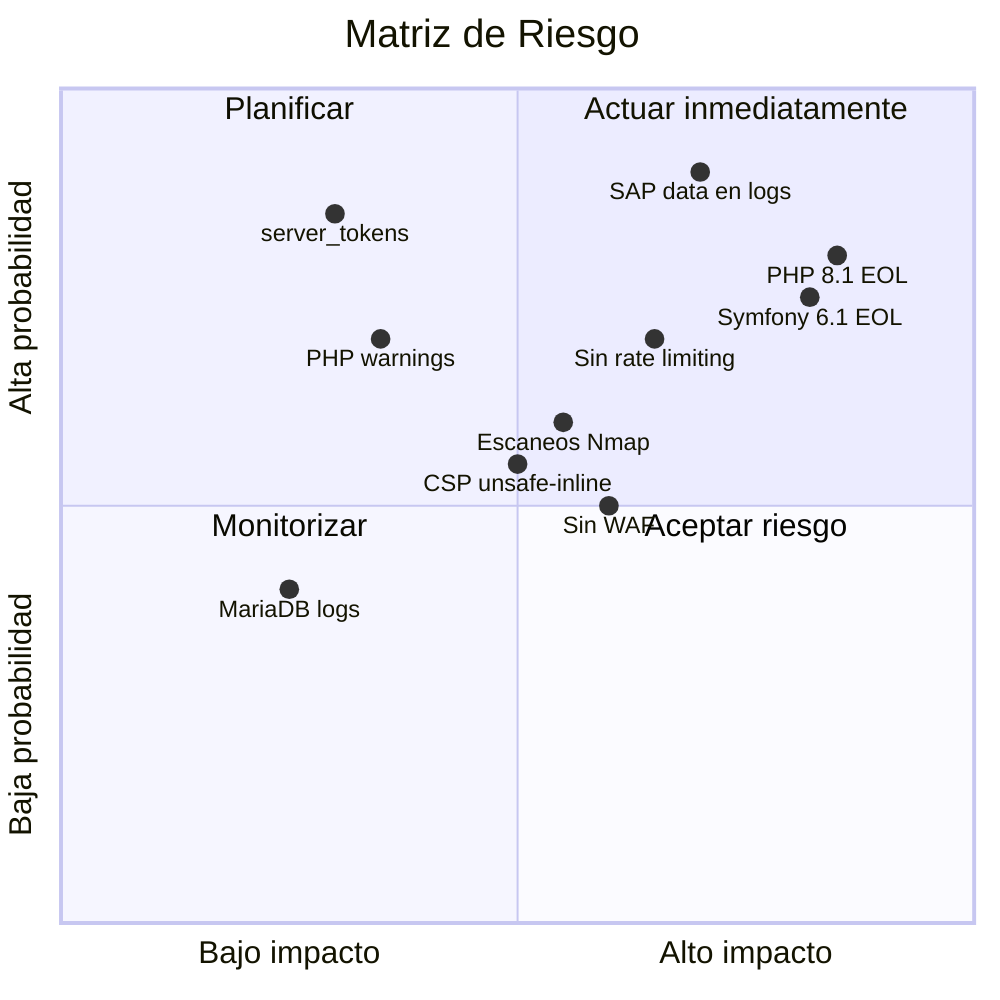

# Auditoría de Seguridad basada en Logs

**Servidor**: WEBAPPSPROD (`10.120.204.93`)  
**Fecha de auditoría**: 27 abril 2026  
**Período de logs**: 23 abril – 27 abril 2026  
**Fuentes**: nginx error.log, nginx access.log, php-fpm.log, journalctl, mysqld.log, monolog.yaml

---

## Resumen ejecutivo

| Severidad | Hallazgos | Detalle |
|-----------|-----------|---------|
| 🔴 **Crítico** | 3 | Escaneos de reconocimiento múltiples, fuga de información SAP en logs, versiones obsoletas |
| 🟠 **Alto** | 4 | Monolog a stderr, login SSO sin rate limit, server_tokens on, sin WAF |
| 🟡 **Medio** | 4 | CSP con unsafe-inline, slow query log deshabilitado, binary log off, PHP warnings en prod |
| 🟢 **Bajo** | 3 | Logs compartidos entre vhosts, RecordedFuture crawler, sin health endpoint |

---

## Análisis de versiones de software

| Software | Versión | EOL / Estado | CVEs conocidos |
|----------|---------|-------------|----------------|
| **PHP** | 8.1.23 | ⚠️ EOL: 31 dic 2025 | Sin parches de seguridad. Vulnerable a CVEs post-EOL |
| **Symfony** | 6.1.x | ⚠️ EOL: ene 2023 | Sin soporte desde hace 3+ años |
| **Nginx** | 1.21.5 | ⚠️ Antigua | Versión mainline de dic 2021. Múltiples fixes publicados |
| **MariaDB** | 10.11.9 | ✅ LTS | Soporte hasta feb 2028 |
| **SLES** | 15 SP6 | ✅ Activo | Soporte de largo plazo activo |

> 🔴 **PHP 8.1 — End of Life**: PHP 8.1 alcanzó su fin de vida el **31 de diciembre de 2025**. No se publican parches de seguridad desde hace 4 meses. Migrar a PHP 8.2 o 8.3.

> 🔴 **Symfony 6.1 — Sin soporte desde enero 2023**: Versión non-LTS con más de 3 años sin actualizaciones de seguridad. Migrar a Symfony 6.4 LTS o 7.x.

---

## Hallazgos de seguridad

### 🔴 SEC-01 — Escaneos de reconocimiento múltiples

**Evidencia**: **3 escaneos distintos** en el período analizado:

**Escaneo 1 — Nmap contra caseportal.werfen.com** (25 abril, 06:49):
```
/human.aspx, /webui, /geoserver/, /owa/, /HNAP1, /nmaplowercheck1777092535,
/cgi-bin/info.cgi, /+CSCOE+/logon.html, /dana-na/nc/nc_gina_ver.txt,
/api/v1/check-version, /Account/Login, /versa/login, /sdk, /dniapi/userInfos
```
- IP origen: `212.163.185.1` (reverse proxy corporativo)
- Firma: URL `/nmaplowercheck1777092535` confirma Nmap NSE scripts
- ~**20 rutas probadas** en 90 segundos

**Escaneo 2 — Scan contra myclaims.werfen.com** (23 abril, 06:21):
```
/magento_version, /helpdesk/WebObjects/Helpdesk.woa, /rest/applinks/1.0/manifest,
/confluence/rest/applinks/1.0/manifest, /language/en-GB/en-GB.xml,
/health, /login.html, /dashboard/, /webui/index.html, /routes,
/api/version, /api/server/version, /portal/, /status, /info.asp
```
- ~**30 rutas probadas** en 90 segundos
- Fingerprinting de Magento, Joomla, Confluence, GeoServer, Pulse VPN, Cisco ASA

**Escaneo 3 — RecordedFuture** (27 abril, 15:29):
```
GET / → 302
GET /admin/E/list → 302
GET /E/login → 200
```
- IP: `10.250.8.10` (red interna) — Servicio legítimo de threat intelligence

**Remediación**:
1. Implementar rate limiting en Nginx: `limit_req_zone` con burst bajo
2. Configurar fail2ban para bloquear IPs con múltiples 404
3. Verificar con seguridad si los scans son autorizados
4. Considerar un WAF (ModSecurity / Cloud WAF)

---

### 🔴 SEC-02 — Fuga de información SAP en logs

**Evidencia**: Cada login SSO genera mensajes en el error.log con:
- Customer IDs de SAP (ej: `0000321227`, `0000111687`)
- Nombres de usuario de clientes (ej: `HOSPIMAX`, `GLOBALSCIENT`, `BIOCELL_MEDI`)
- Respuestas JSON completas de la API SAP

```
[ZQAU_USER_FROM_CLIENTE] Response for customer 0000321227: 
  username=HOSPIMAX, full response: {"E_USERNAME":"HOSPIMAX"}
```

**Riesgo**:
- Violación de privacidad: datos de clientes en texto plano
- Cumplimiento GDPR: customer IDs y usernames son datos personales
- Acceso no autorizado: cualquiera con lectura a `/var/log/nginx/error.log` ve datos de clientes

**Remediación**:
1. **Inmediato**: Cambiar nivel de log de ZQAU a `DEBUG`
2. Eliminar la respuesta JSON completa del mensaje de log
3. Ofuscar/hash los customer IDs en logs
4. Revisar la política de retención de logs (actualmente 365 días con datos de clientes)

---

### 🔴 SEC-03 — Stack de software obsoleto

**PHP 8.1.23** (EOL: 31 dic 2025):
- Sin parches de seguridad desde hace 4 meses
- Vulnerabilidades post-EOL no serán corregidas

**Symfony 6.1** (EOL: ene 2023):
- Más de 3 años sin actualizaciones de seguridad
- Advisories publicados después de 6.1 no se aplican

**Nginx 1.21.5** (dic 2021):
- Versión mainline de hace 4+ años
- Múltiples CVEs corregidos en versiones posteriores

**Remediación**:
1. **Urgente**: PHP 8.1 → 8.3 (LTS)
2. **Urgente**: Symfony 6.1 → 6.4 LTS
3. Nginx 1.21.5 → 1.26.x (estable)

---

### 🟠 SEC-04 — Monolog en producción vía stderr

**Evidencia**: Configuración `monolog.yaml`:
```yaml
when@prod:
    monolog:
        handlers:
            main:
                type: fingers_crossed
                action_level: error
                handler: nested
            nested:
                type: stream
                path: php://stderr    # ← Todo va al error.log de Nginx
                level: debug
                formatter: monolog.formatter.json
```

**Riesgo**:
- Errores de aplicación mezclados con errores de infraestructura
- Sin separación entre apps
- Stack traces completos que exponen rutas internas

**Remediación**:
1. Configurar handler Monolog a archivo: `path: "%kernel.logs_dir%/prod.log"`
2. Añadir handler `syslog` con facility separada por app
3. Considerar centralización con ELK/Grafana Loki

---

### 🟠 SEC-05 — SSO Login sin rate limiting

**Evidencia**: Decenas de logins SSO por minuto sin control de velocidad.

```
06:57:37 — login?sso=... → customer 0000321227
06:57:46 — login?sso=... → customer 0000111687 (NOT FOUND)
06:57:47 — login?sso=... → customer 0000112216 (NOT FOUND)
07:09:35 — login?sso=... → customer 0000289638
07:11:17 — login?sso=... → customer 0000427536 (NOT FOUND)
```

**Remediación**:
1. Rate limiting Nginx: `limit_req_zone $binary_remote_addr zone=login:10m rate=5r/m;`
2. Symfony RateLimiter
3. Bloqueo tras múltiples intentos fallidos

---

### 🟠 SEC-06 — server_tokens habilitado

**Evidencia**: `server_tokens on;` en vhosts de Nginx. Expone `Server: nginx/1.21.5`.

**Remediación**: `server_tokens off;` en `nginx.conf`.

---

### 🟠 SEC-07 — Sin WAF (Web Application Firewall)

**Evidencia**: Escaneos Nmap llegaron sin ser bloqueados. Sin ModSecurity, cloud WAF ni protección.

**Remediación**: ModSecurity con OWASP CRS o Cloud WAF (Cloudflare, Azure WAF).

---

### 🟡 SEC-08 — CSP con 'unsafe-inline'

**Evidencia**: CSP de producción permite `script-src 'unsafe-inline'`:
```
script-src 'self' 'unsafe-inline' cdn.jsdelivr.net code.jquery.com ...
```

**Riesgo**: Reduce protección contra XSS permitiendo scripts inline inyectados.

**Remediación**: Migrar a nonces (`script-src 'nonce-xxx'`) o hashes.

---

### 🟡 SEC-09 — Slow query log deshabilitado

**Evidencia**: `/etc/my.cnf`: `# slow_query_log=1` (comentado).

**Remediación**: `slow_query_log = 1` y `long_query_time = 2`.

---

### 🟡 SEC-10 — Binary log deshabilitado

**Evidencia**: `/etc/my.cnf`: `# log_bin=mysql-bin` (comentado).

**Riesgo**: Sin auditoría de cambios en BD ni recuperación point-in-time.

**Remediación**: Habilitar `log_bin` con retención adecuada.

---

### 🟡 SEC-11 — PHP warnings en producción

**Evidencia**: VendorsPortal genera warnings que exponen rutas internas:
```
PHP Warning: Trying to access array offset on value of type null in 
/srv/www/htdocs/webapps/vendorsportal/releases/20250731071018Z/apps/vendorsportal/
src/Controller/PendingInvoices/PendingInvoicesController.php on line 39
```

**Remediación**:
1. `display_errors = Off` en `php.ini`
2. Corregir null access en controladores
3. Configurar `error_reporting` para prod

---

### 🟢 SEC-12 — Intentos de acceso a MariaDB

**Evidencia**:
```
2025-11-05 14:13:24 — Access denied for user 'mhernandez2'@'localhost' (using password: YES)
```

**Riesgo**: Bajo. Parece intento legítimo con credenciales incorrectas.

---

### 🟢 SEC-13 — Logs compartidos entre vhosts

**Evidencia**: 8 dominios comparten un único `error.log` y `access.log`.

**Remediación**: Configurar `error_log` y `access_log` separados por vhost.

---

### 🟢 SEC-14 — Sin endpoint de health check

**Evidencia**: `/health`, `/status`, `/api/version` retornan 404.

**Remediación**: Implementar endpoints `/health` y `/ready` con verificación de BD y servicios.

---

## Matriz de riesgo



---

## Plan de remediación priorizado

| Prioridad | Acción | Esfuerzo | Impacto |
|-----------|--------|----------|---------|
| 1 | Migrar PHP 8.1 → 8.3 | Alto | Crítico — EOL sin parches |
| 2 | Migrar Symfony 6.1 → 6.4 LTS | Alto | Crítico — 3 años sin seguridad |
| 3 | Mover ZQAU logging de stderr a Monolog channel | Bajo | Alto — Fuga de datos SAP |
| 4 | Implementar rate limiting en `/login` | Bajo | Alto — Previene brute force |
| 5 | `server_tokens off` en nginx.conf | Bajo | Medio — Quick win |
| 6 | Actualizar Nginx 1.21.5 → 1.26.x | Medio | Medio — CVEs conocidos |
| 7 | Habilitar slow query log | Bajo | Medio — Detección SQLi |
| 8 | Configurar logs separados por vhost | Bajo | Medio — Aislamiento |
| 9 | Implementar WAF (ModSecurity) | Medio | Alto — Protección web |
| 10 | Migrar CSP a nonces | Medio | Medio — Protección XSS |
